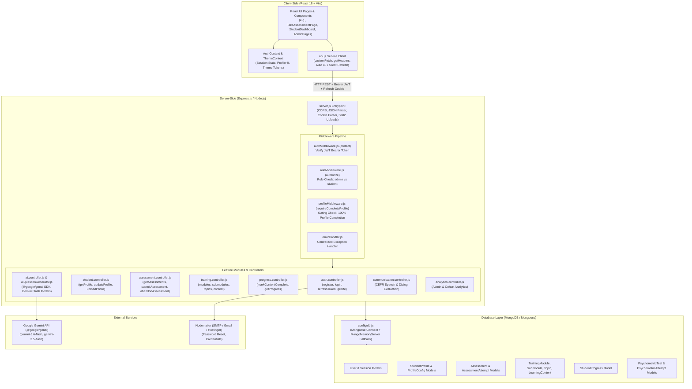
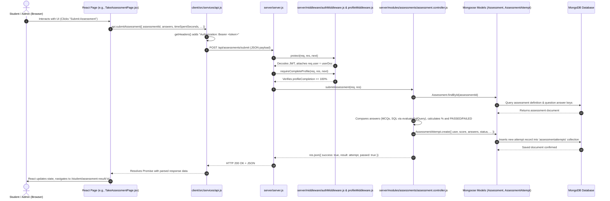

# MITRA Employability Portal — Technical Architecture & Internal Mechanics

This document provides an end-to-end breakdown of how the **MITRA Employability Portal** works internally across the **Frontend (React/Vite)**, **API Layer**, **Backend (Express/Node.js)**, and **Database (MongoDB/Mongoose)**, grounded strictly in the actual codebase files, functions, routes, controllers, and models.

---

## 1. High-Level Architecture Diagram



---

## 2. Frontend → API → Backend → Database Flow (Request Lifecycle)

Here is the exact lifecycle of every data transaction in the platform:



---

## 3. How React Calls the Express/Node.js APIs

### A. Centralized API Client: `client/src/services/api.js`
The frontend does **not** make ad-hoc, unorganized `fetch` or `axios` calls across individual components. Instead, all communication is routed through a centralized API service module: [client/src/services/api.js](file:///d:/VSCode/Mitra_portal/client/src/services/api.js).

1. **Base URL Resolution** ([api.js#L1-L4](file:///d:/VSCode/Mitra_portal/client/src/services/api.js#L1-L4)):
   ```javascript
   const rawBase = (import.meta.env.VITE_API_BASE_URL || '/api').trim().replace(/\/+$/, '');
   export const API_BASE = rawBase.endsWith('/api')
     ? rawBase
     : (rawBase === '' ? '/api' : `${rawBase}/api`);
   ```
   In local development, Vite proxies `/api` to `http://localhost:5000` (defined in [client/vite.config.js](file:///d:/VSCode/Mitra_portal/client/vite.config.js)), or connects directly to the backend URL via `VITE_API_BASE_URL`.

2. **Authorization Header Injection** ([api.js#L19-L25](file:///d:/VSCode/Mitra_portal/client/src/services/api.js#L19-L25)):
   Every outgoing request inspects `localStorage` for the current JWT access token:
   ```javascript
   const getHeaders = () => {
     const token = localStorage.getItem('mitra_token');
     return {
       'Content-Type': 'application/json',
       ...(token ? { Authorization: `Bearer ${token}` } : {})
     };
   };
   ```

3. **HTTP Interceptor with Transparent Token Refresh (`customFetch`)** ([api.js#L29-L94](file:///d:/VSCode/Mitra_portal/client/src/services/api.js#L29-L94)):
   The platform implements a custom wrapper around `window.fetch`:
   - Every request includes `credentials: 'include'` so that the HTTP-only `refreshToken` cookie is sent to the server.
   - If a request receives a **401 Unauthorized** error from an endpoint (other than login/register/refresh), `customFetch` pauses and deduplicates refresh attempts using `refreshPromise`.
   - It calls `POST /api/auth/refresh` using the secure HTTP-only refresh cookie.
   - Upon receiving a fresh access token, it stores it in `localStorage.setItem('mitra_token', newToken)`, updates the `Authorization: Bearer <newToken>` header, and automatically retries the original request seamlessly.
   - If refresh fails, it clears the token and fires the custom window event `mitra:auth-expired`.

### B. React Authentication State: `client/src/context/AuthContext.jsx`
- [client/src/context/AuthContext.jsx](file:///d:/VSCode/Mitra_portal/client/src/context/AuthContext.jsx) wraps the entire component tree inside `<AuthProvider>`.
- On application load, `initializeAuth()` checks `localStorage.getItem('mitra_token')`.
- If found, it invokes `api.getMe()` (`GET /api/auth/me`).
- If expired, it silently attempts `api.refreshToken()` (`POST /api/auth/refresh`).
- It stores `user`, `token`, and calculates `profileCompletion` percentage.

---

## 4. How Routes, Controllers, Middleware, Services, and Models Work Together

The backend adheres to a modular MVC/service architecture located inside [server/modules/](file:///d:/VSCode/Mitra_portal/server/modules).

```
server/
├── server.js                        # App initialization, global middlewares, routing table
├── config/
│   ├── db.js                        # MongoDB Mongoose connection & fallback logic
│   └── constants.js                 # Official departments, student years, roles
├── middleware/
│   ├── authMiddleware.js            # JWT protection (protect)
│   ├── roleMiddleware.js            # Role-based access control (authorize)
│   ├── profileMiddleware.js         # Mandatory profile completion gating (requireCompleteProfile)
│   ├── cookieMiddleware.js          # Lightweight cookie header parser
│   └── errorHandler.js              # Catch-all Express error handling
├── modules/
│   ├── auth/                        # user.model.js, session.model.js, auth.controller.js, auth.routes.js, token.util.js
│   ├── students/                    # student.model.js, student.controller.js, student.routes.js
│   ├── assessments/                 # assessment.models.js, question.model.js, assessment.controller.js, assessment.routes.js
│   ├── training/                    # training.models.js, training.controller.js, training.routes.js
│   ├── progress/                    # progress.model.js, progress.controller.js, progress.routes.js
│   ├── ai/                          # psychometric.model.js, ai.controller.js, ai.routes.js
│   ├── communication/               # communication.model.js, communication.controller.js, communication.routes.js
│   ├── analytics/                   # analytics.controller.js, analytics.routes.js
│   ├── gamification/                # gamification.model.js, gamification.service.js, gamification.routes.js
│   └── settings/                    # settings.model.js, settings.controller.js, settings.routes.js
└── utils/
    ├── aiQuestionGenerator.js        # Gemini SDK question builder & prompt logic
    ├── aiCommunicationEngine.js     # Gemini speech & communication evaluator
    ├── aiPsychometricAnalyzer.js    # Gemini psychometric profile analyzer
    ├── pdfQuestionExtractor.js       # Gemini & regex PDF syllabus/exam extractor
    └── sqlEvaluator.js              # In-memory SQLite evaluator for SQL question types
```

### Routing Registration in `server.js`
In [server/server.js#L54-L75](file:///d:/VSCode/Mitra_portal/server/server.js#L54-L75), every module is mounted on **both** `/api/<module>` and `/<module>` to ensure backward and frontend routing compatibility:
```javascript
const routes = [
  ['/auth', authRoutes],
  ['/students', studentRoutes],
  ['/training', trainingRoutes],
  ['/progress', progressRoutes],
  ['/assessments', assessmentRoutes],
  ['/questions', questionRoutes],
  ['/communication', communicationRoutes],
  ['/ai', aiRoutes],
  ['/psychometric', aiRoutes],
  ['/analytics', analyticsRoutes],
  ['/reports', reportRoutes],
  ['/support', supportRoutes],
  ['/gamification', gamificationRoutes],
  ['/settings', settingsRoutes]
];
routes.forEach(([path, routeHandler]) => {
  app.use(`/api${path}`, routeHandler);
  app.use(path, routeHandler);
});
```

---

## 5. MongoDB/Mongoose Connection and Data Storage/Retrieval

### A. Connection Strategy: `server/config/db.js`
In [server/config/db.js](file:///d:/VSCode/Mitra_portal/server/config/db.js), MITRA uses a two-tier database connection strategy:
1. **Primary**: Connects to the local or remote MongoDB instance via `process.env.MONGO_URI` (defaults to `mongodb://127.0.0.1:27017/mitra_employability`) with a 5000ms timeout (`serverSelectionTimeoutMS: 5000`).
2. **Fallback**: If MongoDB is not running locally, it intercepts the error and dynamically starts an in-memory database using `mongodb-memory-server` (`MongoMemoryServer.create({ binary: { version: '6.0.12' } })`). This ensures the application never crashes in offline demo or testing environments.

### B. Schemas, Hooks, and Methods
1. **Password Hashing Hook** ([server/modules/auth/user.model.js#L29-L33](file:///d:/VSCode/Mitra_portal/server/modules/auth/user.model.js#L29-L33)):
   ```javascript
   userSchema.pre('save', async function () {
     if (!this.isModified('password')) return;
     const salt = await bcrypt.genSalt(10);
     this.password = await bcrypt.hash(this.password, salt);
   });
   ```
2. **Password Verification Method** ([user.model.js#L35-L37](file:///d:/VSCode/Mitra_portal/server/modules/auth/user.model.js#L35-L37)):
   `userSchema.methods.matchPassword` uses `bcrypt.compare`.
3. **Assessment Length Invariant Hook** ([server/modules/assessments/assessment.models.js#L86-L90](file:///d:/VSCode/Mitra_portal/server/modules/assessments/assessment.models.js#L86-L90)):
   `assessmentSchema.pre('save')` enforces a system-wide ceiling of at most 180 questions per assessment.
4. **Weighted Profile Completion Method** ([server/modules/students/student.model.js#L52-L115](file:///d:/VSCode/Mitra_portal/server/modules/students/student.model.js#L52-L115)):
   `studentProfileSchema.methods.calculateCompletion()` scores a student profile from 0 to 100% across four sections:
   - *Academic & Institutional Identity (30%)*: Name (4), Email (4), ERP (8), Department (4), Gender (4), Year (2), Section (2), Batch (2).
   - *Academic Qualifications & Performance (30%)*: 10th % (10), 12th/Diploma % (10), CGPA (10).
   - *Contact Details & Identity (20%)*: Phone (7), Aadhaar (7), Hometown (6).
   - *Career & Portfolio (20%)*: Resume Link (20).

---

## 6. Authentication and Authorization Flow

```mermaid
flowchart TD
    subgraph LoginFlow ["1. Login & Token Generation"]
        ClientLogin["Client: POST /api/auth/login"] --> AuthCtrl["auth.controller.js: login()"]
        AuthCtrl --> VerifyPass["user.matchPassword(password)"]
        VerifyPass --> GenTokens["token.util.js: generateAccessToken() & generateRefreshToken()"]
        GenTokens --> SaveSession["Session.create({ user, refreshTokenHash, ... })"]
        SaveSession --> SetCookie["Set HTTP-only 'refreshToken' Cookie"]
        SetCookie --> ReturnJSON["Return { success: true, token, user } to React"]
    end

    subgraph ProtectedFlow ["2. Protected Route Access"]
        ClientReq["Client: API Call with 'Authorization: Bearer <token>'"] --> ProtectMW["authMiddleware.js: protect()"]
        ProtectMW --> VerifyJWT["jwt.verify(token, JWT_SECRET)"]
        VerifyJWT --> FindUser["User.findById(decoded.id).select('-password')"]
        FindUser --> StatusCheck{"user.status active?"}
        StatusCheck -- No --> Deny403["403 Forbidden"]
        StatusCheck -- Yes --> SetReqUser["req.user = user"]
        SetReqUser --> RoleMW["roleMiddleware.js: authorize(...roles)"]
        RoleMW -- Role Mismatch --> DenyRole["403 Role Not Authorized"]
        RoleMW -- Role Matches --> ProfileMW["profileMiddleware.js: requireCompleteProfile"]
        ProfileMW -- If role == 'admin' --> PassToController["Next -> Route Controller"]
        ProfileMW -- If role == 'student' --> CheckComp{"profileCompletion >= 100%?"}
        CheckComp -- No --> Gate403["403 Profile Incomplete Gate"]
        CheckComp -- Yes --> PassToController
    end
```



### Middleware Details
1. **`protect`** ([server/middleware/authMiddleware.js](file:///d:/VSCode/Mitra_portal/server/middleware/authMiddleware.js)):
   - Checks `req.headers.authorization` for `Bearer <token>` (or fallback query parameter `?token=`).
   - Verifies the signature using `jwt.verify(token, process.env.JWT_SECRET)`.
   - Fetches the user from MongoDB via `User.findById(decoded.id).select('-password')`.
   - Checks if the user is `suspended` or `inactive`.
   - Attaches `req.user` to the request object.
2. **`authorize(...roles)`** ([server/middleware/roleMiddleware.js](file:///d:/VSCode/Mitra_portal/server/middleware/roleMiddleware.js)):
   - Checks if `roles.includes(req.user.role)`.
   - Rejects with `403 Forbidden` if unauthorized.
3. **`requireCompleteProfile`** ([server/middleware/profileMiddleware.js](file:///d:/VSCode/Mitra_portal/server/middleware/profileMiddleware.js)):
   - Admins bypass this check immediately (`if (req.user.role === 'admin') return next();`).
   - Checks if system maintenance mode is on via `SystemSettings.findOne()`.
   - Fetches `StudentProfile.findOne({ user: req.user._id })`.
   - Compares `profile.profileCompletionPercentage` against the required threshold (default: 100%).
   - If `< 100%`, it returns `403` with `{ requiresProfileCompletion: true, profileCompletion: X }`.

---

## 7. Core Business Logic of Key Modules

### A. Assessments & Tests Module
- **Files**:
  - Routes: [server/modules/assessments/assessment.routes.js](file:///d:/VSCode/Mitra_portal/server/modules/assessments/assessment.routes.js)
  - Controller: [server/modules/assessments/assessment.controller.js](file:///d:/VSCode/Mitra_portal/server/modules/assessments/assessment.controller.js)
  - Models: [server/modules/assessments/assessment.models.js](file:///d:/VSCode/Mitra_portal/server/modules/assessments/assessment.models.js)
- **Key Logic**:
  1. **Answer Masking for Active Tests** ([assessment.controller.js#L147-L153](file:///d:/VSCode/Mitra_portal/server/modules/assessments/assessment.controller.js#L147-L153)): When a student requests `GET /api/assessments/take/:id`, the controller strips `correctAnswer` and `explanation` from each question before sending it to the client so students cannot inspect the DOM or network responses to cheat.
  2. **24-Hour Retake Cooldown** ([assessment.controller.js#L121-L144](file:///d:/VSCode/Mitra_portal/server/modules/assessments/assessment.controller.js#L121-L144)): For official institutional tests, the controller checks `AssessmentAttempt.findOne({ user, assessmentId, attemptedAt: { $gte: Date.now() - 24h } })`. If an attempt exists, the test is locked.
  3. **Auto-Grading** ([assessment.controller.js#L261-L305](file:///d:/VSCode/Mitra_portal/server/modules/assessments/assessment.controller.js#L261-L305)):
     - Standard MCQs are evaluated using case-insensitive trimmed equality.
     - SQL questions are dynamically evaluated against an in-memory SQLite runner via `evaluateSqlQuery(studentVal, schemaSql, referenceQuery)` ([server/utils/sqlEvaluator.js](file:///d:/VSCode/Mitra_portal/server/utils/sqlEvaluator.js)).
  4. **Proctoring Enforcement & Abandonment** ([assessment.controller.js#L162-L230](file:///d:/VSCode/Mitra_portal/server/modules/assessments/assessment.controller.js#L162-L230)): If a student violates anti-cheat rules (3 strikes: tab switches, second person detected, voice detected) or abandons the test, `abandonAssessment()` records a `FAILED` attempt with `isAbandoned: true` and locks the test for 24 hours.

### B. Training & Content Module
- **Files**:
  - Routes: [server/modules/training/training.routes.js](file:///d:/VSCode/Mitra_portal/server/modules/training/training.routes.js)
  - Controller: [server/modules/training/training.controller.js](file:///d:/VSCode/Mitra_portal/server/modules/training/training.controller.js)
  - Models: [server/modules/training/training.models.js](file:///d:/VSCode/Mitra_portal/server/modules/training/training.models.js)
- **Key Logic**:
  - Supports a hierarchy: **TrainingModule** → **Submodule** → **Category** → **Topic** → **LearningContent** (videos, PDFs, notes, code).
  - Also includes **Company** preparation tracks (e.g., TCS, Infosys, Wipro syllabus mapping).
  - Integrates with [server/modules/progress/progress.controller.js](file:///d:/VSCode/Mitra_portal/server/modules/progress/progress.controller.js): when a student completes a piece of content, `markContentComplete()` calculates `submoduleProgressPercentage` and awards gamification XP.

### C. Student & Admin Management Modules
- **Student Profile**:
  - Allows students to update academic details, career links, and upload profile pictures via `uploadProfilePhoto()` (stored in `server/uploads/profiles`).
  - Gated by `requireCompleteProfile` so students cannot take tests until their profile is 100% complete.
- **Admin Management**:
  - Student batch filtering across 9 departments (`CSE`, `IT`, `EXTC`, `AIDS`, `CSE (IOT)`, `Civil`, `Mechanical`, `MCA`, `MBA`).
  - Password reset override: Admin can generate a temporary password or reset tokens for students via `adminResetStudentPassword()`.
  - Content, assessment, and question bank CRUD operations.
  - Analytics dashboard aggregating platform pass rates, average scores, and department-wise metrics ([server/modules/analytics/analytics.controller.js](file:///d:/VSCode/Mitra_portal/server/modules/analytics/analytics.controller.js)).

---

## 8. How Gemini AI is Connected and Used

The MITRA platform uses Google Gemini via the official `@google/genai` Node.js SDK:
```javascript
const { GoogleGenAI } = require('@google/genai');
const ai = new GoogleGenAI({ apiKey: process.env.GEMINI_API_KEY });
```

### Models and Fallback Chains
As implemented in [server/utils/aiQuestionGenerator.js#L201-L260](file:///d:/VSCode/Mitra_portal/server/utils/aiQuestionGenerator.js#L201-L260), MITRA implements an automatic priority fallback chain:
1. `process.env.GEMINI_MODEL` (e.g., `gemini-3.6-flash` or custom configured model)
2. `process.env.GEMINI_FALLBACK_MODEL`
3. `gemini-3.6-flash`
4. `gemini-3.5-flash`
5. `gemini-3.5-flash-lite`

If a model exhausts quota (`429` / `RESOURCE_EXHAUSTED`) or receives a transient `503`, the utility automatically switches to the next fallback Gemini model.

### Key Gemini AI Capabilities in the Project

| Use Case | Implementation File | Function / Description |
| :--- | :--- | :--- |
| **AI Assessment & Question Bank Generation** | [server/utils/aiQuestionGenerator.js](file:///d:/VSCode/Mitra_portal/server/utils/aiQuestionGenerator.js) | `generateQuestionsAI()` generates batches of MCQs across Aptitude, Technical domains, or custom syllabi. Implements deduplication against previous batches. |
| **PDF Syllabus / Exam Paper Extraction** | [server/utils/pdfQuestionExtractor.js](file:///d:/VSCode/Mitra_portal/server/utils/pdfQuestionExtractor.js) | `extractQuestionsFromPdfText()` extracts raw questions from uploaded university exam PDFs and formats them into structured JSON questions. |
| **Speech & Communication Evaluation** | [server/utils/aiCommunicationEngine.js](file:///d:/VSCode/Mitra_portal/server/utils/aiCommunicationEngine.js) | `evaluateResponse()` and `evaluateOverallAssessment()` grade grammar, vocabulary, pronunciation, clarity, and CEFR level (A1 to C2). |
| **Psychometric Behavioral Profiling** | [server/utils/aiPsychometricAnalyzer.js](file:///d:/VSCode/Mitra_portal/server/utils/aiPsychometricAnalyzer.js) | Generates situational judgment questions and analyzes work style, leadership, stress tolerance, and teamwork. |
| **Talent Intelligence Engine** | [server/utils/aiTalentIntelligenceEngine.js](file:///d:/VSCode/Mitra_portal/server/utils/aiTalentIntelligenceEngine.js) | Evaluates candidate resume text against job descriptions, identifying skill gaps and predicting interview readiness. |

---

## 9. Complete End-to-End Feature Trace: Taking & Submitting an Assessment

Here is the exact step-by-step trace of how a student takes and submits an assessment:

### Step 1: Student Navigates to Test
- **UI File**: [client/src/pages/student/TakeAssessmentPage.jsx](file:///d:/VSCode/Mitra_portal/client/src/pages/student/TakeAssessmentPage.jsx)
- **Action**: Student clicks "Take Test" on an assessment card.
- **Frontend Code**: `fetchAssessment()` calls `api.getAssessmentById(id)`.
- **API Call**: `GET /api/assessments/take/:id` with `Authorization: Bearer <token>`.
- **Backend Route**: [server/modules/assessments/assessment.routes.js#L55](file:///d:/VSCode/Mitra_portal/server/modules/assessments/assessment.routes.js#L55)
  - Handled by `protect`, `requireCompleteProfile`, and `getAssessmentById`.
- **Backend Controller**: [server/modules/assessments/assessment.controller.js#L110](file:///d:/VSCode/Mitra_portal/server/modules/assessments/assessment.controller.js#L110)
  - Checks if the test is locked under the 24-hour retake cooldown rule.
  - Strips `correctAnswer` and `explanation` from each question:
    ```javascript
    responseData.questions = responseData.questions.map((q) => {
      const { correctAnswer, explanation, ...rest } = q;
      return rest;
    });
    ```
  - Returns `res.json({ success: true, assessment: responseData })`.

### Step 2: Test Session Starts with Proctoring
- **UI File**: [TakeAssessmentPage.jsx#L680-L702](file:///d:/VSCode/Mitra_portal/client/src/pages/student/TakeAssessmentPage.jsx#L680-L702)
- Triggers fullscreen mode (`triggerFullscreen()`).
- Starts camera stream via `navigator.mediaDevices.getUserMedia()`.
- Registers the active assessment session via `useAssessmentSession().startSession(...)` which collapses the sidebar and protects against accidental page unloads (`window.addEventListener('beforeunload', ...)`).
- Sets up anti-cheat listeners: `visibilitychange` (tab switch), `blur` (window focus loss), audio/speech detectors, and second-person face detection.

### Step 3: Student Clicks "Submit Assessment"
- **UI File**: [TakeAssessmentPage.jsx#L759-L815](file:///d:/VSCode/Mitra_portal/client/src/pages/student/TakeAssessmentPage.jsx#L759-L815)
- User clicks "Final Submit" in the confirmation modal.
- `handleFinalSubmit()` stops media streams, formats answers array:
  ```javascript
  const formattedAnswers = Object.keys(answers).map((qId) => ({
    questionId: qId,
    studentAnswer: answers[qId]
  }));
  ```
- Calls `api.submitAssessment({ assessmentId: id, timeSpentSeconds, answers: formattedAnswers, ... })`.

### Step 4: API Service & HTTP Request
- **Client Service**: [client/src/services/api.js#L442-L449](file:///d:/VSCode/Mitra_portal/client/src/services/api.js#L442-L449)
  ```javascript
  submitAssessment: async (data) => {
    const res = await fetch(`${API_BASE}/assessments/submit`, {
      method: 'POST',
      headers: getHeaders(),
      body: JSON.stringify(data)
    });
    return res.json();
  }
  ```

### Step 5: Backend Route & Middleware Processing
- **Route**: `router.post('/submit', protect, requireCompleteProfile, submitAssessment);` in [server/modules/assessments/assessment.routes.js#L56](file:///d:/VSCode/Mitra_portal/server/modules/assessments/assessment.routes.js#L56)
- **`protect`**: Verifies JWT from header; attaches `req.user`.
- **`requireCompleteProfile`**: Confirms student's profile completion is >= 100%.

### Step 6: Controller Business Logic & Auto-Grading
- **Controller File**: [server/modules/assessments/assessment.controller.js#L233-L365](file:///d:/VSCode/Mitra_portal/server/modules/assessments/assessment.controller.js#L233-L365)
- Controller fetches the authoritative assessment document including hidden answer keys from MongoDB: `Assessment.findById(assessmentId)`.
- Compares each student answer with `question.correctAnswer`:
  - If `qType === 'sql'`, runs `evaluateSqlQuery()`.
  - If MCQ, performs exact string comparison.
  - Tallies `totalScore`, `maxScore`, and `categoryBreakdown`.
- Calculates percentage: `Math.round((totalScore / maxScore) * 100)`.
- Determines status: `percentage >= passingScorePercentage ? 'PASSED' : 'FAILED'`.

### Step 7: Database Storage
- **Mongoose Model**: `AssessmentAttempt.create(...)`
- Inserts new document into `assessmentattempts` collection with:
  - `user`: Student user ID
  - `assessmentId`, `moduleId`, `submoduleId`, `topicId`
  - `score`, `totalMarks`, `percentage`, `status`
  - `answers`: Detailed breakdown with `marksAwarded` and `explanation`
  - `violationsCount` and `proctoringLogs`
  - `attemptNumber`: Incremented based on prior attempts count

### Step 8: Gamification XP Awarding
- Calls `awardActivityXP(userId, 'DEFAULT_ASSESSMENT_PASS', assessment._id, assessment.title)` in [server/modules/gamification/gamification.service.js](file:///d:/VSCode/Mitra_portal/server/modules/gamification/gamification.service.js) if passed, plus `HIGH_SCORE_BONUS` if `>= 80%`.

### Step 9: Response & UI Navigation
- Controller sends response: `res.json({ success: true, result: attempt, passed: true })`.
- Frontend receives response in `TakeAssessmentPage.jsx#L800-L806`.
- Calls `endSession()` to release the assessment lock.
- Navigates to `/student/assessment-result/${res.result._id}`.
- [client/src/pages/student/AssessmentResultPage.jsx](file:///d:/VSCode/Mitra_portal/client/src/pages/student/AssessmentResultPage.jsx) renders the score, passing badge, time taken, category analysis charts, and question-by-question review with explanations.

---

## 10. Summary of Key Files & Function Mappings

| Feature / Responsibility | Client Files & Functions | Server Routes & Middleware | Server Controller & Models |
| :--- | :--- | :--- | :--- |
| **Authentication & Tokens** | `AuthContext.jsx`<br/>`api.login()`, `api.refreshToken()` | `POST /api/auth/login`<br/>`POST /api/auth/refresh`<br/>`middleware/authMiddleware.js` | `auth.controller.js` (`login`, `refreshToken`)<br/>`user.model.js`, `session.model.js` |
| **Profile Gating (100%)** | `StudentLayout.jsx`<br/>`ProfilePage.jsx` | `middleware/profileMiddleware.js`<br/>(`requireCompleteProfile`) | `student.controller.js` (`getProfile`, `updateProfile`)<br/>`student.model.js` (`calculateCompletion`) |
| **Assessment Delivery** | `TakeAssessmentPage.jsx`<br/>`api.getAssessmentById()` | `GET /api/assessments/take/:id`<br/>`protect`, `requireCompleteProfile` | `assessment.controller.js` (`getAssessmentById`)<br/>`assessment.models.js` (`Assessment`) |
| **Assessment Submission** | `TakeAssessmentPage.jsx`<br/>`api.submitAssessment()` | `POST /api/assessments/submit`<br/>`protect`, `requireCompleteProfile` | `assessment.controller.js` (`submitAssessment`)<br/>`assessment.models.js` (`AssessmentAttempt`) |
| **AI Question Generator** | `AIAssessmentGenPage.jsx`<br/>`api.generateAIQuestions()` | `POST /api/questions/generate-ai`<br/>`protect`, `authorize('admin')` | `question.controller.js` (`generateAI`)<br/>`utils/aiQuestionGenerator.js` (`generateQuestionsAI`) |
| **Training & Submodules** | `TrainingPage.jsx`<br/>`SubmoduleViewPage.jsx`<br/>`api.getModules()`, `api.markContentComplete()` | `GET /api/training/modules`<br/>`POST /api/progress/complete` | `training.controller.js`, `progress.controller.js`<br/>`training.models.js`, `progress.model.js` |
| **Admin Analytics** | `AnalyticsPage.jsx`<br/>`api.getAdminAnalytics()` | `GET /api/analytics/admin`<br/>`protect`, `authorize('admin')` | `analytics.controller.js` (`getAdminAnalytics`)<br/>Aggregates `User`, `StudentProfile`, `AssessmentAttempt` |

---

*Generated for the MITRA Employability Portal codebase.*
