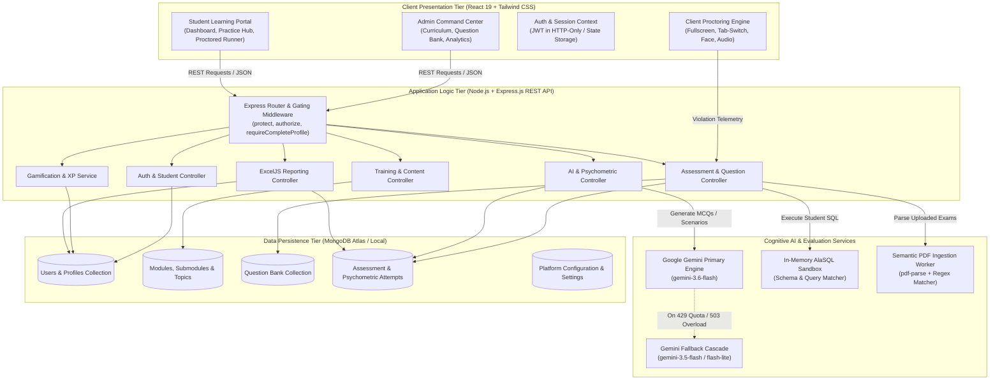
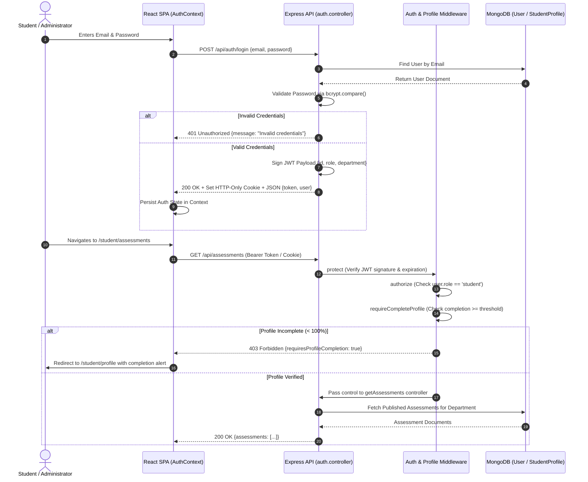
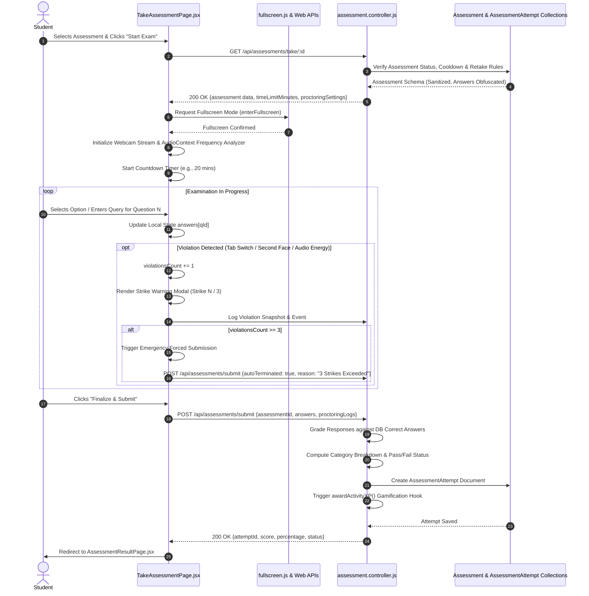
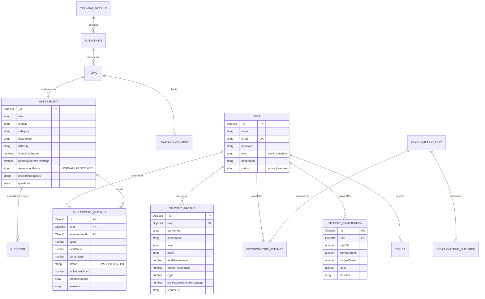
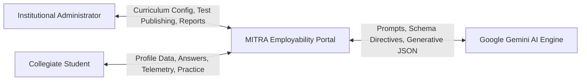
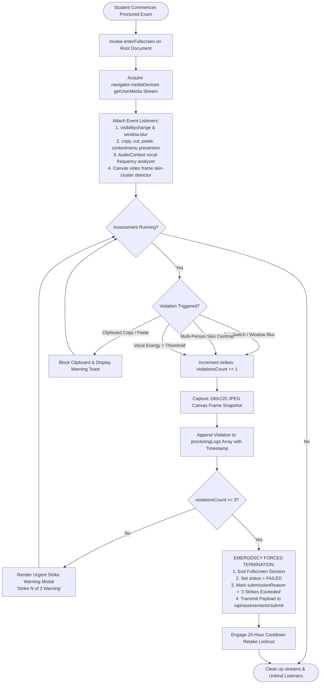

# MITRA EMPLOYABILITY PORTAL
## AI-Assisted, Department-Aware Employability Training and Assessment Platform

---

### A SEMINAR REPORT
*Submitted in partial fulfillment of the requirements for the degree of*  
**Bachelor of Technology in Computer Science & Engineering**

---

**Academic Year:** 2025–2026  
**Institution:** Department of Computer Science & Engineering  
**Platform Name:** MITRA Employability Portal  
**Document Generation Target:** Team Meat (Final Compilation Pipeline for 60–70 Page Seminar Report)

---

## ABSTRACT

Contemporary higher education institutions face an acute challenge in bridging the divergence between standardized academic curriculums and rapidly transforming corporate recruitment benchmarks. Conventional Campus Placement and Training (T&P) administrations rely predominantly on fragmented learning management systems, external commercial test portals, and manual evaluation methodologies. These conventional mechanisms suffer from three critical deficiencies: the absence of department-aware contextualized learning pathways, the static exhaustion of generic multiple-choice question banks, and the lack of holistic psychometric and behavioral talent intelligence.

To resolve these fundamental limitations, this report presents the design, architectural formulation, and operational implementation of the **MITRA Employability Portal** (*AI-Assisted, Department-Aware Employability Training and Assessment Platform*). Built on an enterprise three-tier web architecture employing React.js with Tailwind CSS on the frontend, a Node.js and Express.js RESTful API tier, and a document-oriented MongoDB persistence layer, MITRA introduces a centralized, role-based ecosystem for institutional administrators and students.

The primary technological innovation of MITRA is its native integration with the **Google Gemini Generative AI Engine** via the `@google/genai` SDK. The platform implements an automated assessment generation pipeline that translates syllabus parameters, Bloom's Taxonomy cognitive depths, and department specializations into rigorously structured question sets complete with options, validated correct keys, and step-by-step academic explanations. To circumvent large language model latency and transient API quotas, the architecture incorporates exponential backoff retries, JSON AST parsing sanitizers, and an intelligent Gemini model fallback cascade (`gemini-3.6-flash`, `gemini-3.5-flash`, `gemini-3.5-flash-lite`). Furthermore, MITRA features an automated PDF question extractor capable of parsing unstructured examination documents into structured schemas using chunked semantic windowing.

Beyond cognitive testing, MITRA provides a specialized **Psychometric & Talent Intelligence Engine** that assesses ten core workplace behavioral competencies (including Emotional Intelligence, Adaptability, Resilience, and Problem Solving) across seven distinct psychometric formats (Likert scales, Situational Judgment Tests, and Forced-Choice matrices). Integrated anti-cheating mechanisms implement multi-layered proctoring, comprising full-screen lock enforcement, tab-switch monitoring, client-side skin-centroid cluster detection for multi-person intrusion alerts, and background vocal frequency analysis via the Web Audio API. Gamified progression algorithms (experience points, dynamic level computation, and active daily streaks) systematically incentivize continuous learning. Empirical deployments demonstrate that the MITRA portal successfully unifies training, automated evaluation, and multidimensional placement readiness reporting into a cohesive, secure, and horizontally scalable institutional platform.

---

## TABLE OF CONTENTS

- **ABSTRACT**
- **LIST OF FIGURES**
- **LIST OF SCREENSHOTS**
- **LIST OF TABLES**
- **CHAPTER 1: INTRODUCTION**
  - 1.1 Background
  - 1.2 Problem Statement
  - 1.3 Motivation
  - 1.4 Objectives
  - 1.5 Scope
  - 1.6 Proposed Solution
  - 1.7 Significance of the Project
- **CHAPTER 2: LITERATURE SURVEY**
  - 2.1 Overview
  - 2.2 Existing Employability Platforms
  - 2.3 Existing Assessment Systems
  - 2.4 Existing Learning Management Systems
  - 2.5 AI in Education and Assessment
  - 2.6 AI-Assisted Question Generation
  - 2.7 Online Assessment and Proctoring
  - 2.8 Limitations of Existing Systems
  - 2.9 Research/Technology Gap
  - 2.10 Proposed System
- **CHAPTER 3: METHODOLOGY**
  - 3.1 Proposed System
  - 3.2 System Architecture
  - 3.3 System Block Diagram
  - 3.4 System Workflow
  - 3.5 User Roles
  - 3.6 Admin Workflow
  - 3.7 Student Workflow
  - 3.8 Authentication Flow
  - 3.9 Assessment Workflow
  - 3.10 AI Question Generation Workflow
  - 3.11 Database Design
  - 3.12 Data Flow
  - 3.13 Flowcharts
  - 3.14 Algorithms / Logic
- **CHAPTER 4: IMPLEMENTATION**
  - 4.1 Development Environment
  - 4.2 Frontend Implementation
  - 4.3 Backend Implementation
  - 4.4 Database Implementation
  - 4.5 Authentication and Authorization
  - 4.6 Admin Dashboard
  - 4.7 Student Dashboard
  - 4.8 Training Modules
  - 4.9 Aptitude Module
  - 4.10 Domain Knowledge Module
  - 4.11 Assessment Module
  - 4.12 Psychometric and Behavioral Module
  - 4.13 Practice Hub
  - 4.14 AI Question Generation
  - 4.15 Study Material Management
  - 4.16 Progress Tracking
  - 4.17 XP and Streak System
  - 4.18 Leaderboard
  - 4.19 Proctoring / Anti-Cheating
  - 4.20 Reports and Results
  - 4.21 Deployment
- **CHAPTER 5: COMPONENT DESCRIPTION**
  - 5.1 Hardware Requirements
  - 5.2 Software Requirements
  - 5.3 Frontend Components
  - 5.4 Backend Components
  - 5.5 Database Components
  - 5.6 API Components
  - 5.7 AI Components
  - 5.8 Security Components
  - 5.9 External Services
- **CHAPTER 6: APPLICATION**
  - 6.1 Educational Institutions
  - 6.2 Placement Training
  - 6.3 Student Skill Development
  - 6.4 Employability Assessment
  - 6.5 Department-Specific Training
  - 6.6 Placement Preparation
  - 6.7 AI-Assisted Learning
  - 6.8 Assessment and Performance Monitoring
- **CHAPTER 7: ADVANTAGES AND DISADVANTAGES**
  - 7.1 Advantages
  - 7.2 Disadvantages
  - 7.3 Current Limitations
  - 7.4 Technical Limitations
- **CHAPTER 8: CONCLUSION AND FUTURE SCOPE**
  - 8.1 Conclusion
  - 8.2 Future Scope
  - 8.3 Possible AI Improvements
  - 8.4 Scalability
  - 8.5 Advanced Analytics
  - 8.6 Advanced Proctoring
  - 8.7 Mobile Application
  - 8.8 Additional Assessment Types
- **REFERENCES**
- **APPENDIX: PROGRAM**

---

## LIST OF FIGURES

- **Figure 3.1**: High-Level Enterprise 3-Tier System Architecture of MITRA Portal
- **Figure 3.2**: Comprehensive System Block Diagram and Inter-Module Communications
- **Figure 3.3**: End-to-End User Authentication, Profile Gating, and JWT Session Lifecycle
- **Figure 3.4**: Student Assessment Execution, State Tracking, and Result Evaluation Sequence
- **Figure 3.5**: Google Gemini AI Dynamic Question Generation and Fallback Model Cascade
- **Figure 3.6**: Entity-Relationship Diagram (ERD) of Core MongoDB Collections
- **Figure 3.7**: Data Flow Diagram Level 0 (Context Level)
- **Figure 3.8**: Data Flow Diagram Level 1 (Operational Decomposition)
- **Figure 3.9**: Logic Flowchart for Client-Side Anti-Cheating & Proctoring Violation Handler
- **Figure 3.10**: Gamification XP Accrual and Daily Streak Calculation State Machine
- **Figure 4.1**: Psychometric Radar Chart Mapping 10 Workplace Competencies

---

## LIST OF SCREENSHOTS

- **[INSERT SCREENSHOT: Admin Dashboard]**  
  *Figure S.1: Admin Analytics Command Center displaying platform pass rate, active students, department-wise comparative metrics, and global configuration status.*
- **[INSERT SCREENSHOT: Student Dashboard]**  
  *Figure S.2: Student Dashboard displaying real-time profile completion progress bar, active streak counter, accumulated XP, level badges, and available assessments.*
- **[INSERT SCREENSHOT: Content Management Interface]**  
  *Figure S.3: Hierarchical Content Management Suite illustrating Training Module, Category, Submodule, and Topic tree management with rich video lectures and PDF notes.*
- **[INSERT SCREENSHOT: AI Question Generator]**  
  *Figure S.4: AI Question Generator interface configured with subject domain, department context, Bloom's cognitive taxonomy, and batch question generation previews.*
- **[INSERT SCREENSHOT: Question Bank Management Page]**  
  *Figure S.5: Centralized Question Bank with full-text search, topic filtering, bulk question import, manual MCQ creator, and PDF parsing review modal.*
- **[INSERT SCREENSHOT: Assessment Creation and Configuration Page]**  
  *Figure S.6: Assessment Creator form with time limits, passing cutoffs, question selection, randomized sequencing, and proctoring toggle switches.*
- **[INSERT SCREENSHOT: Test Attempt and Examination Interface]**  
  *Figure S.7: Student Examination Runner displaying real-time countdown timer, question palette navigation, review markers, and clean mathematical formatting.*
- **[INSERT SCREENSHOT: Proctoring and Anti-Cheating Security Interface]**  
  *Figure S.8: Proctored Examination environment displaying floating active webcam monitor, full-screen lock indicator, and 3-strike violation warning modal.*
- **[INSERT SCREENSHOT: Assessment Result and Detailed Diagnostic Page]**  
  *Figure S.9: Post-Assessment Performance Report presenting percentage score, category breakdown, question-by-question explanations, and audit logs.*
- **[INSERT SCREENSHOT: Psychometric Assessment Runner]**  
  *Figure S.10: Behavioral Talent Evaluation screen illustrating Likert-scale sliders, forced-choice trade-off matrices, and Situational Judgment Test scenarios.*
- **[INSERT SCREENSHOT: One-Page Talent Intelligence Report]**  
  *Figure S.11: Executive Talent Intelligence Dossier displaying radar competence plots, Big-5 psychological attributes, strengths, and targeted development recommendations.*
- **[INSERT SCREENSHOT: Student Profile Gating & Master Export]**  
  *Figure S.12: Student 4-Section Profile completion wizard and Admin Multi-Tab Excel (.xlsx) export utility with comprehensive academic and placement filters.*

---

## LIST OF TABLES

- **Table 3.1**: System User Roles and Functional Authority Matrix
- **Table 3.2**: MongoDB Schema Structural Breakdown and Cross-Collection References
- **Table 4.1**: System Development Environment and Software Version Matrix
- **Table 4.2**: Official Academic Departments Supported in MITRA
- **Table 4.3**: Psychometric Competencies and Calibrated Question Format Distribution
- **Table 4.4**: Gamification Activity XP Allocations and Trigger Criteria
- **Table 4.5**: Anti-Cheating Violation Classifications, Detection Modalities, and Strike Policies
- **Table 5.1**: Minimum and Recommended Hardware Requirements
- **Table 5.2**: Client and Server Production Software Dependencies
- **Table 5.3**: RESTful API Endpoint Architecture and Security Authorization Constraints
- **Table 7.1**: Feature Implementation Matrix (Fully Operational vs. Demo vs. Future Roadmap)

---

# CHAPTER 1: INTRODUCTION

### 1.1 Background
The global employment landscape for collegiate engineering and management graduates has undergone radical structural changes over the past decade. Corporate hiring organizations have transitioned from broad, mass-recruitment paradigms to precision-oriented competency evaluations [1]. Modern corporate screening tests no longer evaluate students purely on general cognitive aptitude; rather, they demand a synthesized balance of core quantitative capability, department-specific domain competencies, software/algorithmic problem-solving, situational judgment, and workplace behavioral maturity [2]. 

Concurrently, higher educational institutions—specifically engineering colleges and universities offering undergraduate and postgraduate degrees such as Bachelor of Technology (B.Tech), Master of Computer Applications (MCA), and Master of Business Administration (MBA)—struggle to establish scalable internal preparation infrastructures. Traditionally, Campus Placement and Training (T&P) cells attempt to address these needs via disconnected manual interventions: external third-party guest lectures, physical paper-and-pencil diagnostic tests, or generic open-access web repositories. These fragmented mechanisms fail to track continuous student progress, lack contextual awareness of distinct engineering disciplines, and provide zero administrative visibility into department-level readiness gaps prior to campus placement drives.

### 1.2 Problem Statement
Existing academic and placement training practices in collegiate environments exhibit severe systemic deficiencies:
1. **Curricular Disconnection and Department Agnosticism:** General aptitude portals treat computer scientists, mechanical engineers, and civil engineers identically, failing to offer specialized, department-curated technical training modules aligned with actual industrial job descriptions.
2. **Static Question Depletion and High Content Maintenance Costs:** Traditional test engines rely on fixed question databases. Faculty and T&P administrators must manually draft, verify, and input questions. Over time, students memorize static test questions, leading to inflated evaluation scores and compromised assessment integrity.
3. **Assessment Integrity Deficits in Unsupervised Environments:** Distributed online tests conducted outside centralized computer laboratories are heavily vulnerable to academic dishonesty, unauthorized browser tab switching, collaborative group testing, and copy-pasting answers from external generative search engines.
4. **Neglect of Non-Cognitive and Psychometric Dimensions:** Technical competence alone does not guarantee long-term workplace success. Corporate recruiters systematically evaluate emotional intelligence, situational judgment, teamwork, adaptability, and resilience. Existing campus software platforms provide no scientific evaluation of psychometric or behavioral traits.
5. **Data Fragmentation and Inefficient Placement Filtering:** Student placement databases (academic marks, 10th/12th/diploma percentages, backlog statuses, resume links) remain separated from assessment evaluation data, requiring placement officers to spend days consolidating spreadsheets manually before recruitment eligibility deadlines.

### 1.3 Motivation
The development of the **MITRA Employability Portal** is driven by the urgent need to create a unified, intelligent, and autonomous institutional bridge between academic study and industrial placement readiness. By engineering an end-to-end web platform that couples dynamic cloud infrastructure with advanced Large Language Models (LLMs)—specifically Google Gemini—it becomes possible to democratize high-quality placement training across diverse engineering departments. Faculty administrators can generate calibrated examinations spanning distinct cognitive taxonomies in seconds, while students gain continuous access to department-specific curricula, self-paced interactive practice engines, and scientific talent intelligence diagnostics without requiring expensive commercial coaching subscriptions.

### 1.4 Objectives
The primary architectural and functional objectives of the MITRA project are as follows:
- **Centralized Institutional Governance:** To engineer a secure, role-based platform distinguishing Administrative authorities (T&P officers, faculty coordinators) from Students across all undergraduate and postgraduate cohorts.
- **Department-Aware Curricula Framework:** To implement a structured hierarchy (Modules → Categories → Submodules → Topics → Resources) providing customized technical pathways for nine official departments (EXTC, CSE, IT, AIDS, CSE-IOT, Civil, Mechanical, MCA, MBA).
- **Autonomous AI-Assisted Assessment Engine:** To harness the Google Gemini API (`@google/genai`) to generate original, psychometrically calibrated, and Bloom-aligned multiple-choice questions with verified keys and comprehensive explanations on demand.
- **Unstructured Document Ingestion via Semantic Parsing:** To design an automated PDF question extractor capable of parsing raw academic examination papers and institutional question documents into structured, database-ready question objects.
- **Multimodal Anti-Cheating & Proctoring Framework:** To implement client-side browser surveillance incorporating full-screen lock enforcement, tab-switch interception, skin-centroid cluster detection for unauthorized individuals, and audio frequency analysis for background voice activity.
- **Scientific Behavioral & Psychometric Profiling:** To model and execute multidimensional psychometric assessments measuring ten key workplace competencies across seven question formats, synthesizing automated radar plots and executive talent intelligence reports.
- **Gamified Engagement and Continuous Analytics:** To formulate an automated experience point (XP) engine, streak counter, and level advancement algorithm, coupled with administrative analytics and multi-tab dynamic Excel (.xlsx) reporting.

### 1.5 Scope
The functional scope of the MITRA Employability Portal encompasses:
- Institutional authentication supporting credential security, administrative password reset workflows, and strict multi-section profile gating.
- Structured training resource delivery across Aptitude (Quantitative, Logical Reasoning, Verbal), Department Knowledge, Communication, Resume Formulation, and Interview Preparation.
- Interactive topic-level practice with immediate scoring, explanatory walkthroughs, and in-memory SQL execution via AlaSQL.
- Automated AI question generation, question bank cataloging, and administrative assessment publishing.
- High-stakes proctored test running with automated violation tracking, strike counters, and immediate cooldown-enforced retest policies.
- Automated psychometric evaluation producing dynamic Big-5 trait distributions and personalized development recommendations.
- Dynamic export of filtered master placement rosters based on aggregate CGPA, test scores, backlog counts, and department affiliations.

*Scope Boundaries:* The current implementation focuses on standard web browsers (Google Chrome, Mozilla Firefox, Microsoft Edge) supporting modern Web APIs (HTML5 Fullscreen, MediaDevices, Canvas API, Web Audio API). Native mobile apps and remote server-side biometric video streaming remain designated for subsequent project phases.

### 1.6 Proposed Solution
The MITRA platform resolves the aforementioned challenges through a modern, cloud-native three-tier architecture:
- **Presentation Tier:** A responsive Single-Page Application (SPA) constructed using React.js 19 and Tailwind CSS v4, leveraging Vite for optimized build pipelines, React Router DOM v7 for declarative role-protected routing, and TanStack React Query v5 for asynchronous server state synchronization.
- **Business Logic Tier:** A modular Node.js and Express.js REST API structured around domain-driven modules (`auth`, `students`, `training`, `assessments`, `ai`, `communication`, `gamification`, `analytics`, `reports`, `settings`, `support`).
- **Intelligence Tier:** Google Gemini AI integration utilizing the `@google/genai` library with an automated multi-tier model fallback hierarchy (`gemini-3.6-flash`, `gemini-3.5-flash`, `gemini-3.5-flash-lite`), aggressive backoff routines, and defensive JSON abstract-syntax-tree parsers.
- **Persistence Tier:** A schema-enforced MongoDB database managed via Mongoose ODM, maintaining normalized relationships across student profiles, hierarchical training taxonomies, question repositories, assessment attempts, and audit logs.

### 1.7 Significance of the Project
MITRA introduces significant technological and operational value to higher education:
- **Elimination of Administrative Bottlenecks:** T&P administrators reduce examination creation time from several days to under two minutes through automated Gemini-powered question synthesis.
- **Data-Driven Placement Interventions:** Institutional leaders can quantitatively assess department-wide strengths and deficiencies using real-time pass-rate analytics and spider radar plots.
- **Fair and Objective Evaluations:** Multi-layered proctoring deters opportunistic cheating in distributed test environments, safeguarding institutional assessment credibility.
- **Holistic Student Growth:** By coupling cognitive assessment with behavioral psychometrics and gamified consistency mechanics, students develop well-rounded career profiles suited for modern corporate ecosystems.

---

# CHAPTER 2: LITERATURE SURVEY

### 2.1 Overview
The integration of digital assessment systems, computer-adaptive testing, and artificial intelligence in university-to-corporate transitions represents an active area of educational technology research. This chapter investigates established platforms, pedagogical assessment frameworks, AI question generation literature, automated proctoring mechanisms, identifies critical technology gaps, and contextualizes the contributions of the MITRA Employability Portal.

### 2.2 Existing Employability Platforms
Commercial employability and placement assessment platforms such as AMCAT (Aspiring Minds Computer Adaptive Test), CoCubes (Aon Hewitt), eLitmus, and HackerRank have achieved broad adoption across Indian engineering colleges [3]. 
- **AMCAT and CoCubes:** Utilize proprietary psychometric and cognitive testing batteries to rank students for hiring companies. While robust, these commercial platforms function as closed, external "black boxes." Academic faculties cannot inspect assessment questions, tailor curricula to institutional syllabi, or modify passing thresholds. Furthermore, their recurring per-student subscription fees impose severe budgetary burdens on colleges.
- **HackerRank and LeetCode:** Excel in pure algorithmic and software engineering evaluation. However, they provide minimal coverage for non-software disciplines (such as Civil, Mechanical, or Electrical engineering) and lack institutional training hierarchies, resume-building modules, and administrative placement roster filtering [4].

### 2.3 Existing Assessment Systems
Computer-Based Testing (CBT) systems have evolved from simple electronic page-turners to complex computerized adaptive engines. The primary structural model historically employed in educational measurement is Item Response Theory (IRT), where question difficulty, student ability, and guessing parameters are modeled mathematically [5]. Standard open-source CBT systems (such as TCExam or TAO Testing) provide reliable question-banking capabilities. However, these systems are fundamentally static: they depend upon human subject-matter experts to write and tag every item manually, rendering the maintenance of dynamic, non-depleting question banks economically unfeasible for individual collegiate departments.

### 2.4 Existing Learning Management Systems
Conventional Learning Management Systems (LMS) such as Moodle, Canvas by Instructure, and Blackboard serve as the digital backbone for formal collegiate coursework [6]. While these platforms offer content delivery (PDF uploads, forum discussions, assignment submissions), their internal assessment engines are limited to basic quiz formats. They lack automated industry-aligned employability training taxonomies, department-specific placement tracking, real-time code/SQL query evaluation, and AI-driven curriculum synthesis. Furthermore, their generic user interfaces fail to offer gamification architectures (such as daily active streaks and dynamic leveling) necessary to sustain student engagement during rigorous placement preparation.

### 2.5 AI in Education and Assessment
The application of Artificial Intelligence in Education (AIED) has shifted dramatically with the emergence of Large Language Models (LLMs) built on the Transformer architecture [7]. Historically, Natural Language Processing (NLP) in assessment was confined to automated essay scoring using shallow syntactic parsers and latent semantic analysis. Contemporary LLMs possess profound semantic representations capable of synthesizing contextually rich problem statements, evaluating open-ended technical explanations, and generating plausible distractors for multiple-choice examinations [8]. In high-stakes institutional settings, however, LLM integration requires robust guardrails to prevent hallucinations, format invalidity, and conceptual drift.

### 2.6 AI-Assisted Question Generation
Recent research by Vaswani et al. [7] and subsequent investigations into instruction-tuned LLMs demonstrate that generative models can produce educational questions aligned with specific cognitive levels defined by Bloom’s Revised Taxonomy (Remembering, Understanding, Applying, Analyzing, Evaluating, and Creating) [9]. Standard API integrations often fail in production due to stochastic output variability—models frequently output conversational conversational preambles, malformed JSON objects, or LaTeX escape syntax errors that crash downstream parsers [10]. Literature emphasizes that enterprise-grade educational systems must implement programmatic JSON schema enforcement, sanitization filters, and deterministic fallback routines to achieve high operational reliability [11].

### 2.7 Online Assessment and Proctoring
Unsupervised online testing has necessitated the development of automated remote proctoring systems. Commercial solutions such as Proctorio, Honorlock, and Mettl utilize heavy native desktop client applications or intrusive browser extensions to lock down operating systems [12]. Research in lightweight, web-standard proctoring demonstrates that significant cheating vectors can be mitigated entirely within modern browser APIs:
- **Full-Screen Enforcement:** Utilizing the W3C Fullscreen API to eliminate secondary desktop window access [13].
- **Visibility and Focus Tracking:** Intercepting HTML5 Page Visibility API (`document.hidden`) and window blur events to detect tab switching [14].
- **Lightweight Computer Vision:** Deploying client-side canvas image processing or the experimental Web FaceDetector API to verify face presence and detect secondary persons without streaming bandwidth-heavy video feeds to centralized servers [15].
- **Vocal Frequency Energy Monitoring:** Processing client-side audio via the Web Audio API (`AudioContext`, FFT spectral analysis) to detect nearby whispering or dialogue while preserving user privacy [16].

### 2.8 Limitations of Existing Systems
A synthesis of existing academic literature and commercial solutions reveals five primary shortcomings:
1. High financial licensing costs that prevent universal, democratic student adoption.
2. Inflexible, one-size-fits-all curricula that ignore department-specific engineering specializations.
3. High vulnerability of static question databases to student memorization and collusion.
4. Heavy, invasive proctoring agents that trigger privacy concerns and require specialized computer operating systems.
5. Inability to synthesize technical evaluation data with scientific psychometric behavioral indices.

### 2.9 Research/Technology Gap
While individual research projects have explored isolated facets—such as LLM question drafting [9], lightweight browser proctoring [14], or gamified learning mechanics [6]—there is an evident absence of a cohesive, open, and integrated institutional platform that synthesizes:
- Automated, department-aware generative AI question creation;
- Automated unstructured document (PDF) exam parsing;
- Non-invasive client-side multimodal proctoring;
- Calibrated 10-trait behavioral talent intelligence;
- Dynamic placement profile gating and multi-tab executive reporting.

### 2.10 Proposed System
The **MITRA Employability Portal** directly bridges this research and technological gap. By uniting React.js, Node.js, Express.js, MongoDB, and the Google Gemini API into an interconnected architecture, MITRA establishes an institutional platform that automates the generation, proctored execution, behavioral profiling, and placement tracking of collegiate students across diverse engineering branches.

---

# CHAPTER 3: METHODOLOGY

### 3.1 Proposed System
The MITRA platform is designed as an autonomous, department-aware employability ecosystem. Operationally, the system transitions conventional manual placement training into a self-updating digital loop. Administrative personnel maintain top-level governance over curricula, assessment parameters, question bank repositories, and institutional policy rules. Students interact with personalized dashboards tailored strictly to their departmental identity, engaging in structured video/notes learning, interactive topic practice, proctored formal evaluations, and psychometric talent profiling.

### 3.2 System Architecture
MITRA implements a Decoupled Three-Tier Client-Server Architecture augmented by an external Generative AI Cognitive Service Tier. The architectural layers interact through secure HTTPS/REST communication protocols.


*Figure 3.1: High-Level Enterprise 3-Tier System Architecture of MITRA Portal.*

### 3.3 System Block Diagram
The system comprises discrete functional subsystems operating across distinct lifecycle phases:

```mermaid
graph LR
    subgraph INGESTION ["1. Content & Assessment Ingestion"]
        A1[Faculty Manual Entry]
        A2[AI Prompt Blueprint]
        A3[Unstructured PDF Exam]
    end

    subgraph PROCESSING ["2. Core Processing & Normalization"]
        B1[Question Sanitizer & Deduplicator]
        B2[Department Curriculum Taxonomies]
        B3[Rule-Based Anti-Cheat Policy Config]
    end

    subgraph EXECUTION ["3. Delivery & Student Interaction"]
        C1[Curriculum Reader & Video Player]
        C2[Interactive Topic Practice Runner]
        C3[High-Stakes Proctored Exam Engine]
        C4[Talent Intelligence Psychometric Runner]
    end

    subgraph EVALUATION ["4. Scoring, Analytics & Reporting"]
        D1[Automated Grading & Feedback]
        D2[XP, Level & Streak Gamifier]
        D3[Radar Competency Visualizer]
        D4[ExcelJS Multi-Tab Placement Export]
    end

    INGESTION --> PROCESSING
    PROCESSING --> EXECUTION
    EXECUTION --> EVALUATION
```


*Figure 3.2: Comprehensive System Block Diagram and Inter-Module Communications.*

### 3.4 System Workflow
The operational lifecycle within MITRA functions across three sequential phases:
1. **Administrative Setup Phase:** Administrators configure system settings, establish curriculum hierarchies, seed department learning topics, set profile completion gating rules, and populate the Question Bank via manual authoring, Gemini AI batch synthesis, or PDF ingestion.
2. **Student Preparation Phase:** Students complete mandatory institutional identity profiles, explore department-specific training modules, study attached PDF notes and video lectures, and execute interactive topic practice tests with immediate explanatory feedback.
3. **Assessment & Diagnostic Phase:** Students undertake official proctored examinations under active browser surveillance. Upon test finalization, the system evaluates responses, updates gamification records, records audit logs, generates question explanations, and populates the institutional placement master roster.

### 3.5 User Roles
The platform rigorously enforces two distinct operational roles:

| Role Attribute | Institutional Administrator (`admin`) | Registered Student (`student`) |
| :--- | :--- | :--- |
| **Primary Responsibility** | Governance, curriculum design, assessment publishing, audit analysis. | Academic preparation, topic practice, exam completion, profile updates. |
| **Authentication Scope** | Global admin dashboard access, system settings modification. | Personal dashboard, training modules, assigned assessments, results. |
| **Content Authority** | Full CRUD on Modules, Submodules, Categories, Topics, and Notes. | Read-only access to published curriculum materials; cannot alter content. |
| **Assessment Authority** | Create, generate via AI, publish, archive, and delete tests. | Attempt published tests subject to retake cooldowns; review own score reports. |
| **Question Bank Access** | Direct access to edit, bulk-delete, AI-generate, and import PDF questions. | No direct question bank access; receives questions only during active tests. |
| **Proctoring Authority** | Configure violation thresholds, camera/fullscreen rules, view attempt logs. | Must comply with client-side proctoring rules; penalized on violations. |
| **Reporting Authority** | Generate cross-department analytics, download master Excel reports. | View personal historical progress, radar competency plots, and scorecards. |

*Table 3.1: System User Roles and Functional Authority Matrix.*

### 3.6 Admin Workflow
The administrative user journey proceeds systematically through the Command Center:
1. **Authentication:** Administrator logs in via `/login`, verified against bcrypt-hashed credentials stored in the `User` collection.
2. **Dashboard Review:** The administrator reviews key performance indicators (KPIs) on `AdminDashboard.jsx`: platform-wide pass rate, student count, assessment counts, department performance splits, and pending registration approvals.
3. **Curriculum & Content Management:** Via `ContentManagementPage.jsx`, the admin structures learning pathways by selecting a domain (e.g., Domain Knowledge → CSE or Aptitude → Quantitative), adding Submodules (e.g., "Database Management Systems"), creating Topics ("Indexing & B-Trees"), and attaching learning assets (YouTube URLs, PDF notes, or rich Markdown articles).
4. **Question Bank Curation:** Via `QuestionBankManagementPage.jsx`, the admin inspects the central repository. The admin may click "Generate with AI" to trigger a Gemini batch generation job or upload an institutional semester examination paper via the PDF extraction modal.
5. **Assessment Publishing:** On `AssessmentManagementPage.jsx`, the administrator configures a new formal assessment: setting duration (minutes), passing cutoff percentage, difficulty, department constraints, proctoring toggles (camera, tab switch, second person, audio), and selecting either randomized question bank sampling or AI-generated items.
6. **Analytics & Placement Reporting:** The admin navigates to `ReportsPage.jsx` or `StudentExportPage.jsx` to apply placement criteria (e.g., Minimum CGPA >= 7.5, No Active Backlogs, Assessment Score >= 70%) and downloads styled, multi-tab Microsoft Excel (`.xlsx`) rosters.

### 3.7 Student Workflow
The student journey follows an integrated learning, practice, and testing path:
1. **Registration & Institutional Gating:** The student registers with their official college email and department. Upon first login, MITRA's `requireCompleteProfile` middleware checks their `profileCompletionPercentage`. If mandatory fields (ERP number, 10th/12th marks, current CGPA, resume URL) are missing, navigation to training and assessments is locked until the profile reaches the administrator-defined completion threshold.
2. **Dashboard Orientation:** The student accesses `StudentDashboard.jsx`, viewing their active streak count, accumulated XP, current level, profile strength, and upcoming proctored tests.
3. **Training & Self-Paced Learning:** Navigating to `TrainingPage.jsx`, the student selects their departmental track (e.g., Civil Engineering → Structural Analysis) or Aptitude track. They open topic nodes, watch curated video lectures, and read downloadable PDF study notes.
4. **Interactive Practice Hub:** The student launches self-paced tests on `TopicPracticeRunnerPage.jsx`. They answer questions across conceptual, code-output, and SQL domains. In-memory evaluation via AlaSQL provides immediate query feedback without altering permanent test records.
5. **Formal Proctored Examination:** On `StudentAssessmentsPage.jsx`, the student selects a published test. If a 24-hour retake cooldown is active, the test remains locked. Upon launch, `TakeAssessmentPage.jsx` initiates hardware readiness checks (webcam stream verification, full-screen lock). The student executes the exam under active surveillance.
6. **Performance Review & Talent Intelligence:** Following submission, `AssessmentResultPage.jsx` presents comprehensive score breakdowns and question explanations. The student also undertakes the `PsychometricPage.jsx` talent diagnostic, receiving an executive talent intelligence report mapping their Big-5 traits and core workplace competencies.

### 3.8 Authentication Flow
Security in MITRA relies on JSON Web Tokens (JWT) coupled with salted bcrypt password hashing:


*Figure 3.3: End-to-End User Authentication, Profile Gating, and JWT Session Lifecycle.*

### 3.9 Assessment Workflow
The execution of an official institutional assessment requires stringent state coordination:


*Figure 3.4: Student Assessment Execution, State Tracking, and Result Evaluation Sequence.*

### 3.10 AI Question Generation Workflow
The Google Gemini AI question generation pipeline operates through a resilient, multi-stage architecture designed to guarantee structural integrity, question novelty, and uninterrupted service availability:

```mermaid
flowchart TD
    Start([Admin Requests AI Question Generation]) --> FormInput[Input Parameters: Module, Category, Department, Topic, Difficulty, Question Count]
    FormInput --> PromptBuilder[Construct Grounded Industrial Prompt\n+ Explicit JSON Schema Specification\n+ Bloom's Cognitive Directives\n+ Deduplication Signatures of Last 25 Questions]

    PromptBuilder --> PrimaryModel[Invoke Google Gemini Primary Model\n'gemini-3.6-flash' via @google/genai SDK]

    PrimaryModel -->|Network / Model Error| ErrorCheck{Error Type?}
    ErrorCheck -->|429 Quota Exhausted OR 503 Overload| FallbackModel1[Switch to Secondary Fallback:\n'gemini-3.5-flash']
    ErrorCheck -->|Timeout > 20s| FallbackModel1
    FallbackModel1 -->|Quota Exhausted| FallbackModel2[Switch to Tertiary Fallback:\n'gemini-3.5-flash-lite']

    PrimaryModel -->|HTTP 200 Success| RawOutput[Capture Raw Generative Output Text]
    FallbackModel1 -->|HTTP 200 Success| RawOutput
    FallbackModel2 -->|HTTP 200 Success| RawOutput

    RawOutput --> Sanitizer[JSON AST Parser & Sanitizer\n1. Strip ```json and ``` code blocks\n2. Strip <think> reasoning tags\n3. Sanitize unescaped LaTeX backslashes\n4. Extract substring between first '[' and last ']']

    Sanitizer --> ASTValidation{Valid JSON Array with N Questions?}
    ASTValidation -->|No: Malformed Structure| RegexRecovery[Fallback Regex Object Matcher:\nRecover individual valid question entities]
    ASTValidation -->|Yes: Successfully Parsed| DedupEngine[Deduplication & Validation Engine:\n- Verify exactly 4 options per MCQ\n- Verify correctAnswer matches one option\n- Filter string-similarity duplicates]

    RegexRecovery --> DedupEngine
    DedupEngine --> DatabaseSave[(Persist Validated Questions to Question Bank / Assessment)]
    DatabaseSave --> Complete([Admin Review & Final Acceptance Modal])
```
*Figure 3.5: Google Gemini AI Dynamic Question Generation and Fallback Model Cascade.*

### 3.11 Database Design
The MITRA data architecture is implemented on MongoDB. It balances strict schema validation with document-oriented nesting to optimize query performance for hierarchical curricula, detailed assessment audits, and talent profiles:


*Figure 3.6: Entity-Relationship Diagram (ERD) of Core MongoDB Collections.*

#### Detailed Collection Schema Breakdown

| Collection Name | Primary Purpose | Key Fields & Constraints | Relationships & References |
| :--- | :--- | :--- | :--- |
| **`users`** | Central authentication entity. | `name`, `email` (unique, lowercase), `password` (bcrypt hash), `role` (enum: `admin`, `student`), `department` (official 9 depts), `status`. | Referenced by `StudentProfile`, `AssessmentAttempt`, `Gamification`. |
| **`studentprofiles`** | Institutional placement records & profile gating. | `user` (1-to-1 unique), `erpNumber`, `rollNo`, `tenthPercentage`, `twelfthPercentage`, `cgpa`, `resumeUrl`, `profileCompletionPercentage` (0–100%). | 1-to-1 mapping with `User`. |
| **`trainingmodules`** | Top-level academic domain nodes. | `title`, `module` (enum: Aptitude, Domain, Communication, Resume, Interview), `department`, `order`, `status`. | 1-to-Many parent of `Submodule`. |
| **`submodules`** | Curricular units within modules. | `moduleId` (ref), `title`, `category`, `topic`, `order`, `status`. | Child of `TrainingModule`, Parent of `Topic`. |
| **`topics`** | Atomic learning & practice units. | `title`, `categoryId`, `defaultAssessmentId` (ref), `order`, `status`. | Child of `Submodule`, hosts `LearningContent`. |
| **`learningcontents`** | Actual pedagogical assets. | `topicId` (ref), `title`, `content` (Markdown), `videoUrl`, `pdfUrl`, `resourceType` (enum: video, note, pdf, link). | Many-to-1 reference to `Topic`. |
| **`questions`** | Central Question Bank master items. | `questionText`, `codeSnippet`, `type` (mcq, sql, coding), `options` (array of 4), `correctAnswer`, `explanation`, `difficulty`, `aiGenerated` (bool). | Categorized by Module, Category, Department, Topic. |
| **`assessments`** | Test definitions and configurations. | `title`, `module`, `department`, `questions` (embedded schema array, capped at 180), `timeLimitMinutes`, `passingScorePercentage`, `assessmentMode` (`NORMAL`/`PROCTORED`), `proctoringSettings`. | Created by Admin User, instantiated by Attempts. |
| **`assessmentattempts`** | Permanent examination audit records. | `user` (ref), `assessmentId` (ref), `score`, `totalMarks`, `percentage`, `status` (`PASSED`/`FAILED`), `violationsCount`, `proctoringLogs` (type, timestamp, snapshot). | Junction entity between `User` and `Assessment`. |
| **`psychometrictests`** | Behavioral test blueprints. | `title`, `category`, `durationMinutes`, `questionCount` (1–30), `competencies` (array of 10), `questions` (embedded items with formats). | Target for student behavioral profiling. |
| **`psychometricattempts`** | Multi-trait behavioral diagnostic results. | `user` (ref), `overallScore`, `traitScores` (10 nested competency scores, levels, explanations), `strengths`, `developmentAreas`, `aiAnalysis`. | Evaluated via Talent Intelligence Engine. |
| **`studentgamifications`** | Engagement, streak & XP tracker. | `user` (ref, unique), `totalXP`, `currentStreak`, `longestStreak`, `lastActiveDate` (YYYY-MM-DD), `level`, `activities` (array). | Updated on lecture completion, practice, and test passes. |
| **`systemsettings`** | Global platform configuration. | `platform` (academicYear, approvalMode), `profileGating`, `aiConfig` (model, limits), `proctoring` (thresholds, strike limits). | Singleton administrative configuration document. |

*Table 3.2: MongoDB Schema Structural Breakdown and Cross-Collection References.*

### 3.12 Data Flow

#### Data Flow Diagram: Level 0 (Context Diagram)
At the boundary level, the MITRA portal interacts with three external entities: Administrators, Students, and the Google Gemini AI Platform:


*Figure 3.7: Data Flow Diagram Level 0 (Context Level).*

#### Data Flow Diagram: Level 1 (Operational Decomposition)
Within the system boundary, data flows across discrete storage and processing processes:

```mermaid
flowchart TD
    Admin[Admin User] -->|1. Setup Curricula & Materials| P1[Content Management Engine]
    Admin -->|2. Trigger AI Synthesis| P2[AI Generation Controller]
    P2 <-->|API Calls & Parsed JSON| ExtAI[(Google Gemini API)]
    P2 -->|Save Validated MCQs| D1[(Question Bank DB)]
    P1 -->|Store Modules, Topics & Notes| D2[(Curriculum DB)]

    Admin -->|3. Configure & Publish Exam| P3[Assessment Orchestrator]
    D1 -->|Sample Questions| P3
    P3 -->|Store Assessment Spec| D3[(Assessments DB)]

    Student[Student User] -->|4. Authenticate & Complete Profile| P4[Auth & Gating Engine]
    P4 -->|Verify Completion >= 100%| D4[(User & Profile DB)]

    Student -->|5. Access Study Material| P5[Learning Delivery Engine]
    D2 -->|Stream Videos & Notes| P5

    Student -->|6. Execute Proctored Assessment| P6[Examination Runner & Proctoring Client]
    D3 -->|Provide Test Questions| P6
    P6 -->|Stream Answers & Violation Events| P7[Evaluation & Scoring Engine]
    P7 -->|Commit Graded Attempt & Audit Logs| D5[(Assessment Attempts DB)]
    P7 -->|Trigger XP & Streak Update| P8[Gamification Engine]
    P8 -->|Update Total XP & Level| D4

    Admin -->|7. Request Filtered Placement Roster| P9[Reporting & Export Engine]
    D4 -->|Extract Academic CGPA & ERP| P9
    D5 -->|Extract Pass Rates & Scores| P9
    P9 -->|Download Multi-Tab XLSX| Admin
```


*Figure 3.8: Data Flow Diagram Level 1 (Operational Decomposition).*

### 3.13 Flowcharts

#### Client-Side Proctoring & Violation Detection Logic
The real-time monitoring loop runs on the client browser during active assessment sessions:


*Figure 3.9: Logic Flowchart for Client-Side Anti-Cheating & Proctoring Violation Handler.*

### 3.14 Algorithms / Logic

#### Algorithm 1: Dynamic Daily Streak & XP Accrual Algorithm
The gamification engine calculates daily consistency and awards experience points idempotently upon activity triggers:

```
Algorithm: AwardActivityXPAndCalculateStreak
Input: userId (ObjectId), activityType (Enum), refId (String), title (String)
Output: updatedGamificationRecord (Object)

Constants:
    XP_MAP = {
        LECTURE_COMPLETE: 15,
        NOTE_READ: 10,
        TOPIC_COMPLETE: 50,
        DEFAULT_ASSESSMENT_PASS: 40,
        PRACTICE_TEST_COMPLETE: 20,
        HIGH_SCORE_BONUS: 15
    }
    ONE_TIME_ACTIVITIES = ['LECTURE_COMPLETE', 'NOTE_READ', 'TOPIC_COMPLETE', 'DEFAULT_ASSESSMENT_PASS']

1.  Record ← Find StudentGamification document where user == userId
2.  If Record does not exist:
        Record ← Create new StudentGamification(userId, totalXP=0, currentStreak=0, level=1)
3.  If activityType is in ONE_TIME_ACTIVITIES:
        For each act in Record.activities:
            If act.activityType == activityType AND act.refId == refId:
                Return Record  // Prevent duplicate XP accrual
4.  todayStr ← CurrentDate in ISO format "YYYY-MM-DD"
5.  If Record.lastActiveDate == "":
        Record.currentStreak ← 1
        Record.longestStreak ← 1
        Record.lastActiveDate ← todayStr
    Else if Record.lastActiveDate != todayStr:
        lastDate ← ParseDate(Record.lastActiveDate)
        todayDate ← ParseDate(todayStr)
        diffDays ← Round((todayDate - lastDate) in Days)
        If diffDays == 1:
            Record.currentStreak ← Record.currentStreak + 1
        Else if diffDays > 1:
            Record.currentStreak ← 1  // Streak broken
        Record.longestStreak ← Max(Record.longestStreak, Record.currentStreak)
        Record.lastActiveDate ← todayStr
6.  earnedXP ← XP_MAP[activityType] ?? 10
7.  Record.totalXP ← Record.totalXP + earnedXP
8.  Record.level ← Max(1, Floor(Record.totalXP / 100) + 1)
9.  Append new Activity(activityType, refId, earnedXP, title, timestamp=Now) to Record.activities
10. Save Record to Database
11. Return Record
```

#### Algorithm 2: Safe In-Memory SQL Query Evaluation
MITRA evaluates student SQL queries without persistent database overhead or destructive injection hazards using AlaSQL:

```
Algorithm: EvaluateStudentSqlQuery
Input: studentQuery (String), schemaSql (String), expectedQuery (String)
Output: EvaluationResult (pass: Boolean, studentResult: Array, error: String)

1.  If studentQuery is null or empty:
        Return { pass: False, error: "Empty query submitted" }
2.  upperQuery ← UpperCase(studentQuery)
3.  FORBIDDEN ← ["DROP DATABASE", "SHUTDOWN", "SYSTEM", "PROCESS"]
4.  For each keyword in FORBIDDEN:
        If upperQuery contains keyword:
            Return { pass: False, error: "Forbidden SQL keyword detected: " + keyword }
5.  dbName ← "testdb_" + RandomAlphanumericString(8)
6.  Try:
        Execute AlaSQL("CREATE DATABASE " + dbName + "; USE " + dbName + ";")
        If schemaSql is not empty:
            statements ← Split schemaSql by ";"
            For each stmt in statements where stmt is not blank:
                Execute AlaSQL(stmt)
        expectedResult ← Execute AlaSQL(expectedQuery)
        studentResult ← Execute AlaSQL(studentQuery)
        
        // Canonical Tuple Comparison
        pass ← DeepTupleCompare(studentResult, expectedResult)
        Execute AlaSQL("DROP DATABASE " + dbName + ";")
        Return { pass: pass, studentResult: studentResult, expectedResult: expectedResult, error: pass ? Null : "Tuple mismatch" }
    Catch Exception e:
        Try Execute AlaSQL("DROP DATABASE " + dbName + ";") Catch Null
        Return { pass: False, studentResult: Null, error: "Execution Error: " + e.message }
```

---

# CHAPTER 4: IMPLEMENTATION

### 4.1 Development Environment
The implementation of the MITRA Employability Portal utilizes a decoupled modern JavaScript runtime ecosystem.

| Component / Layer | Specification / Runtime Environment |
| :--- | :--- |
| **Operating System** | Windows 11 Enterprise / Ubuntu 22.04 LTS (Production Host) |
| **Node.js Runtime** | Node.js v20 LTS / v22 Current |
| **Backend Framework** | Express.js v5.2.1 |
| **Database System** | MongoDB v7.0 Enterprise / MongoDB Atlas M10 Cluster |
| **ODM Library** | Mongoose v9.9.2 |
| **Frontend Framework** | React.js v19.2.8 |
| **Client Bundler** | Vite v8.2.0 |
| **CSS Framework** | Tailwind CSS v4.3.3 (`@tailwindcss/vite`) |
| **Client Routing** | React Router DOM v7.18.2 |
| **Server State Manager** | TanStack React Query v5.102.8 |
| **Generative AI SDK** | `@google/genai` v2.17.1 (Google Gemini Cloud API) |
| **In-Memory SQL Parser**| AlaSQL v4.17.3 |
| **Document Generators**| ExcelJS v4.4.0 (Multi-Tab XLSX), pdf-parse v1.1.1 (PDF Extraction) |

*Table 4.1: System Development Environment and Software Version Matrix.*

### 4.2 Frontend Implementation
The frontend client application is organized under `client/src` following modular architectural boundaries:
- **Routing & Providers (`App.jsx`):** Configures application-wide context providers: `QueryClientProvider` for query caching, `AuthProvider` for token persistence, `ThemeProvider` for light/dark CSS variable switching, and `BrowserRouter` managing distinct public, student, and admin routing subtrees.
- **Component Design System (`components/`):** Reusable UI components including accessible modals (`Modal.jsx`), high-density data tables (`DataTable.jsx`), progress meters (`ProgressBar.jsx`), metric indicator cards (`StatCard.jsx`), radar visualizers (`RadarChart.jsx`), and interactive code/note editors (`RichNoteEditor.jsx`).
- **Student Interface Suite (`pages/student/`):** Implements dynamic pages including `StudentDashboard.jsx` (metric tiles, active streak indicators), `TrainingPage.jsx` (department course viewer), `TopicPracticeRunnerPage.jsx` (live interactive practice), `TakeAssessmentPage.jsx` (proctored examination runner), and `PsychometricPage.jsx` (behavioral profiling).
- **Admin Command Suite (`pages/admin/`):** Implements administrative consoles: `AdminDashboard.jsx`, `ContentManagementPage.jsx` (hierarchical syllabus editor), `QuestionBankManagementPage.jsx` (AI and PDF question ingestion), `AssessmentManagementPage.jsx`, and `ReportsPage.jsx`.

### 4.3 Backend Implementation
The backend server architecture resides under `server/` and follows a modular domain structure. The entry point `server.js` initializes DNS IPv4 precedence, mounts security middlewares (CORS with credentials, cookie parsing, 20MB JSON body limit), establishes database connectivity, and mounts API module routes on both `/api/*` and `/*` paths for backwards-compatible routing.

The modular directory hierarchy contains:
- `modules/auth/`: Registration, credential verification, JWT issuance, session modeling.
- `modules/students/`: Profile schemas, 4-section weighted completion algorithms, profile gating.
- `modules/training/`: Hierarchical content models (`TrainingModule`, `Submodule`, `Category`, `Topic`, `LearningContent`).
- `modules/assessments/`: Test definitions, question bank repositories, test-taking controllers, and proctoring telemetry loggers.
- `modules/ai/`: Gemini API orchestrations, psychometric test definitions, talent report synthesizers.
- `modules/communication/`: Conversational mock interview engine, turn-based dialogue models, speech analysis.
- `modules/gamification/`: Daily streak calculators, level advancement curves, XP transaction logs.
- `modules/analytics/`: Departmental comparison aggregates, pass-rate calculations, student leaderboards.
- `modules/reports/`: ExcelJS streaming controllers for multi-tab placement workbook exports.
- `modules/settings/`: Platform-wide configuration, AI provider limits, and proctoring threshold settings.

### 4.4 Database Implementation
MongoDB serves as the primary persistence layer. Mongoose schemas enforce rigorous type casting, enumeration boundaries, and lifecycle hooks:
- **Capped Schema Arrays:** The `Assessment` schema enforces a pre-save hook that clamps embedded questions to an institutional ceiling of 180 questions per assessment.
- **Password Hashing Lifecycle:** The `User` schema registers a pre-save middleware that verifies password modifications and automatically generates a 10-round bcrypt salt and hash.
- **Compound Query Indexes:** Indexes are established on `email` (unique), `student` references in attempt collections, and `[module, department, topic]` tuples in the question bank.

### 4.5 Authentication and Authorization
Authentication utilizes JSON Web Tokens (JWT) signed using HMAC-SHA256 with secrets configured via environment variables. Access control is enforced via Express middleware:
- `protect`: Validates the bearer token extracted from HTTP authorization headers or cookies. Verifies cryptographic signature and checks user existence.
- `authorize(...roles)`: Role-Based Access Control (RBAC) middleware verifying whether `req.user.role` matches authorized permissions (e.g., `'admin'`).
- `requireCompleteProfile`: Specialized institutional gating middleware that inspects `studentProfile.profileCompletionPercentage`. If the completion percentage falls below the administrative threshold (100%), the student is restricted from attempting assessments or accessing training modules.

### 4.6 Admin Dashboard
The Admin Dashboard (`AdminDashboard.jsx`) functions as the institutional mission control. It displays real-time key metrics: Total Enrolled Students, Active Students, Published Training Modules, Active Assessments, Platform Pass Rate, and Aggregate Assessment Score. In addition, it renders comparative bar charts across all nine official departments and displays the top-performing students on the institutional leaderboard.

### 4.7 Student Dashboard
The Student Dashboard (`StudentDashboard.jsx`) provides an engaging, personalized command view for learners:
- **Hero Progress Banner:** Highlights current profile completion percentage with direct links to resolve incomplete profile sections.
- **Gamification Header:** Renders current level badge, numerical level progress bar, total accumulated XP, and current daily streak flame counter.
- **Active Curricula & Assessments:** Lists newly assigned proctored assessments, practice tests, and recently accessed learning topics.

### 4.8 Training Modules
Curriculum management is structured across a 5-tier taxonomic hierarchy:
$$\text{Module} \longrightarrow \text{Category} \longrightarrow \text{Submodule} \longrightarrow \text{Topic} \longrightarrow \text{Learning Content}$$
Faculty administrators can attach multiple learning assets to any topic node, including embedded YouTube video lectures, downloadable PDF lecture notes, and rich Markdown articles created via the built-in `RichNoteEditor.jsx`.

### 4.9 Aptitude Module
The Aptitude module provides universal preparation across three fundamental placement categories:
1. **Quantitative Aptitude:** Time and Work, Percentages, Profit and Loss, Ratio and Proportion, Speed, Distance & Time, Probability, Permutations & Combinations, Simple & Compound Interest, Number Systems.
2. **Logical Reasoning:** Blood Relations, Coding-Decoding, Number & Letter Series, Syllogisms, Direction Sense, Seating Arrangements, Analytical Puzzles, Clocks & Calendars.
3. **Verbal Ability:** Sentence Correction, Reading Comprehension, Synonyms & Antonyms, Prepositions, Spotting Errors, Active & Passive Voice, Idiomatic Expressions.

### 4.10 Domain Knowledge Module
The Domain Knowledge module tailors training specifically to the nine recognized academic departments:

| Official Department Code | Department Nomenclature | Representative Technical Modules |
| :--- | :--- | :--- |
| **CSE** | Computer Science & Engineering | Data Structures, Algorithms, OS, DBMS, Computer Networks, System Design. |
| **IT** | Information Technology | Web Technologies, Cloud Computing, Network Security, Software Engineering. |
| **AIDS** | Artificial Intelligence & Data Science | Machine Learning, Deep Learning, Python for Data Science, NLP, Computer Vision. |
| **CSE (IOT)** | CSE - Internet of Things | Embedded Systems, Microcontrollers, Sensor Networks, IoT Cloud Protocols. |
| **EXTC** | Electronics & Telecommunication | Signals & Systems, Digital Signal Processing, VLSI, Analog Circuits, Telecom. |
| **Civil** | Civil Engineering | Structural Analysis, Fluid Mechanics, Concrete Technology, Surveying, Geotech. |
| **Mechanical** | Mechanical Engineering | Thermodynamics, Fluid Mechanics, Theory of Machines, CAD/CAM, Heat Transfer. |
| **MCA** | Master of Computer Applications | Advanced Java, Full-Stack Development, Enterprise Databases, Software Testing. |
| **MBA** | Master of Business Administration | Financial Management, Marketing Analytics, Human Resource Strategy, Operations. |

*Table 4.2: Official Academic Departments Supported in MITRA.*

### 4.11 Assessment Module
The Assessment engine supports two operational modalities: `NORMAL` (self-paced, unmonitored practice) and `PROCTORED` (high-stakes, surveillance-enforced examinations). Assessments support multiple question types:
- Standard Multiple-Choice Questions (MCQ)
- Conceptual Reasoning Questions
- Code Output Determination (incorporating preformatted syntax blocks)
- In-Memory SQL Query Challenges (evaluated via AlaSQL)
- Algorithmic Coding Problem Stubs

Retake policies are strictly enforced via the backend controller: when an assessment retake policy is set to `cooldown`, a 24-hour lockout timer is initiated upon test submission, preventing immediate re-attempts and encouraging deliberate restudy.

### 4.12 Psychometric and Behavioral Module
The Psychometric engine evaluates non-cognitive placement readiness. Built upon validated organizational psychology frameworks (including the Big Five Personality Model and Situational Judgment Test methodologies), the system measures ten critical workplace competencies:

| Competency | Evaluated Behavioral Trait | Calibrated Format Distribution (30 Qs) |
| :--- | :--- | :--- |
| **Communication** | Clarity, active listening, structured articulation, diplomacy. | 3 Likert, 1 SJT, 1 Frequency |
| **Teamwork** | Collaborative synergy, conflict de-escalation, cross-functional support. | 2 Likert, 1 SJT, 1 Forced Choice |
| **Leadership** | Decision decisiveness, inspiring consensus, ownership, accountability. | 2 Likert, 1 SJT, 1 Ranking |
| **Adaptability** | Resilience in shifting priorities, intellectual curiosity, cognitive agility. | 2 Likert, 1 Scenario, 1 SJT |
| **Emotional Intelligence**| Empathetic awareness, emotion regulation, stress tolerance. | 2 Likert, 1 SJT, 1 Self-Assessment |
| **Problem Solving** | Root-cause analysis, objective deduction, data-driven synthesis. | 2 Likert, 1 Scenario, 1 SJT |
| **Initiative** | Proactive problem discovery, entrepreneurial mindset, independence. | 1 Likert, 1 Frequency, 1 Forced Choice |
| **Time Management** | Task prioritization, deadline adherence, boundary setting. | 1 Likert, 1 Frequency, 1 Ranking |
| **Resilience** | Composure under failure, perseverance, overcoming adversity. | 1 Likert, 1 SJT, 1 Forced Choice |
| **Professionalism** | Ethical compliance, reliability, work ethic, corporate decorum. | 2 Likert, 1 SJT, 1 Scenario |

*Table 4.3: Psychometric Competencies and Calibrated Question Format Distribution.*

The system generates a multidimensional radar chart (`RadarChart.jsx`) mapping competency percentage distributions alongside an executive talent intelligence dossier (`OnePageTalentReport.jsx`).

### 4.13 Practice Hub
Implemented via `TopicPracticeRunnerPage.jsx`, the Practice Hub offers students an untimed, constructive sandbox. Unlike formal examinations, practice runs provide immediate explanations upon answer selection, allow resetting individual questions, and support safe in-browser SQL query execution against seeded tables using AlaSQL.

### 4.14 AI Question Generation
The AI Generation engine (`server/utils/aiQuestionGenerator.js`) interfaces directly with Google Gemini. The system employs structured prompt engineering passing the domain, department context, Bloom's cognitive taxonomy level, and negative deduplication lists containing the last 25 generated items. The response is processed through `cleanAndParseJson()`, stripping markdown backticks, eliminating `<think>` tags, normalizing LaTeX formulas, and validating that every question contains four distinct options with a congruent correct answer.

### 4.15 Study Material Management
Administrators utilize `ContentManagementPage.jsx` to curate rich educational resources. The interface integrates YouTube video validation, direct PDF uploads managed via Multer with 25MB limits, and rich Markdown article generation via `RichNoteEditor.jsx`. Students access PDF documents through an in-browser modal reader (`NoteReaderModal.jsx`) that prevents unauthorized document downloading where restricted.

### 4.16 Progress Tracking
Student progress is captured continuously in the `StudentProgress` collection. The platform tracks content completion states across videos, notes, topic practices, and formal examinations. Progress aggregation algorithms compute percentage completion for individual submodules, feeding into student dashboards and administrative departmental reports.

### 4.17 XP and Streak System
The gamification system incentivizes daily student engagement through algorithmic reward triggers:

| Gamification Activity Type | XP Points Awarded | Accrual Constraints |
| :--- | :--- | :--- |
| **`LECTURE_COMPLETE`** | 15 XP | One-time reward per video asset. |
| **`NOTE_READ`** | 10 XP | One-time reward per PDF/note asset. |
| **`TOPIC_COMPLETE`** | 50 XP | Awarded upon completing all topic assets. |
| **`DEFAULT_ASSESSMENT_PASS`** | 40 XP | Awarded on scoring $\ge$ passing cutoff. |
| **`PRACTICE_TEST_COMPLETE`** | 20 XP | Repeatable upon completing practice runs. |
| **`HIGH_SCORE_BONUS`** | 15 XP | Bonus awarded for assessment scores $\ge 80\%$. |

*Table 4.4: Gamification Activity XP Allocations and Trigger Criteria.*

Dynamic levels advance on a 100 XP per level linear scale:
$$\text{Level} = \max\left(1, \left\lfloor \frac{\text{Total XP}}{100} \right\rfloor + 1\right)$$

### 4.18 Leaderboard
The institutional leaderboard (`server/modules/analytics/analytics.controller.js`) aggregates student test attempts. The algorithm groups attempts by unique student identifiers, calculates the arithmetic mean of all percentage scores for students with one or more attempts, and sorts candidates descendingly to display top academic performers across the institution and within specific departments.

### 4.19 Proctoring / Anti-Cheating
The client-side proctoring engine (`TakeAssessmentPage.jsx`) implements a comprehensive anti-cheating protocol:

| Violation Event | Detection Modality | Trigger Criteria | Policy Penalty |
| :--- | :--- | :--- | :--- |
| **`TAB_SWITCH`** | HTML5 Visibility API | `document.hidden == true` | 1 Strike logged; warning modal. |
| **`WINDOW_BLUR`** | Window Focus Listener | `window.onblur` event fired | 1 Strike logged; warning modal. |
| **`FULLSCREEN_EXIT`** | W3C Fullscreen API | `document.fullscreenElement == null` | Fullscreen re-prompted; Strike logged. |
| **`SECOND_PERSON`** | Canvas Frame Clustering / FaceDetector API | $\ge 2$ faces detected or dual skin centroids | Strike logged + 160x120 JPEG snapshot captured. |
| **`VOICE_DETECTED`** | Web Audio API / `AudioContext` FFT | 100Hz–3000Hz vocal energy $> 45$ dB | Strike logged after 3 consecutive frames. |
| **`CLIPBOARD_COPY`** | Event Prevention | `copy`, `cut`, `paste`, `contextmenu` | Action blocked immediately; Warning toast. |

*Table 4.5: Anti-Cheating Violation Classifications, Detection Modalities, and Strike Policies.*

Accumulation of three strikes triggers immediate automatic termination: the test payload is submitted with `status = FAILED`, `submissionReason = '3 Strikes Exceeded'`, and a 24-hour retake cooldown lock is enforced.

### 4.20 Reports and Results
The reporting module leverages ExcelJS (`report.controller.js`) to generate stylized, audit-ready Microsoft Excel workbooks (`.xlsx`) and CSV files. Placement officers can filter candidates by department, graduation batch, minimum 10th/12th/diploma percentages, current CGPA, backlog status (None / Active), and assessment pass records. Workbooks feature corporate styling: branded blue header rows, bordered gridlines, auto-fitted column widths, and numerical score alignments.

### 4.21 Deployment
The platform is engineered for containerized cloud deployment:
- **Frontend SPA:** Deployed on Vercel utilizing Vite production builds with automated CDN edge distribution.
- **Backend API:** Hosted on Render or a dedicated Linux (Ubuntu) cloud server running Node.js managed via PM2 process managers.
- **Database:** Hosted on MongoDB Atlas with automatic replica set failovers and automated snapshot backups.

---

# CHAPTER 5: COMPONENT DESCRIPTION

### 5.1 Hardware Requirements

| Hardware Parameter | Minimum Specification | Recommended Specification |
| :--- | :--- | :--- |
| **Client Processor** | Dual-Core 2.0 GHz x86/ARM64 | Intel Core i5 / AMD Ryzen 5 / Apple M-Series |
| **Client RAM** | 4 GB | 8 GB or higher |
| **Client Web Camera**| 640x480 (VGA) resolution | 720p / 1080p HD Camera (for proctoring) |
| **Client Microphone**| Integrated Audio Input | Noise-Cancelling Microphone |
| **Network Bandwidth**| 1.0 Mbps stable connection | 5.0 Mbps high-speed broadband |
| **Server CPU** | 1 vCPU (Cloud VM) | 4 vCPU (Dedicated Cloud Host) |
| **Server RAM** | 1 GB (Container instance) | 8 GB RAM |
| **Server Storage** | 10 GB SSD | 50 GB NVMe SSD |

*Table 5.1: Minimum and Recommended Hardware Requirements.*

### 5.2 Software Requirements
The project runtime relies entirely on enterprise open-source software libraries:

```json
{
  "client_dependencies": {
    "react": "^19.2.8",
    "react-dom": "^19.2.8",
    "react-router-dom": "^7.18.2",
    "@tanstack/react-query": "^5.102.8",
    "tailwindcss": "^4.3.3",
    "@tailwindcss/vite": "^4.3.3",
    "lucide-react": "^1.31.0",
    "axios": "^1.19.0",
    "vite": "^8.2.0"
  },
  "server_dependencies": {
    "express": "^5.2.1",
    "mongoose": "^9.9.2",
    "@google/genai": "^2.17.1",
    "jsonwebtoken": "^9.0.3",
    "bcryptjs": "^3.0.3",
    "exceljs": "^4.4.0",
    "alasql": "^4.17.3",
    "pdf-parse": "^1.1.1",
    "multer": "^2.3.0",
    "nodemailer": "^9.0.5",
    "cors": "^2.8.6",
    "dotenv": "^17.4.2"
  }
}
```
*Table 5.2: Client and Server Production Software Dependencies.*

### 5.3 Frontend Components
The frontend UI is decomposed into atomic, single-responsibility React components:
- `Navbar.jsx`: Global navigation bar displaying branding, user departmental identity, active notifications, and theme customizer toggle.
- `Sidebar.jsx`: Collapsible navigation drawer dynamically rendering authorized routes based on active role (`admin` vs. `student`). Automatically auto-closes during active examinations.
- `TakeAssessmentPage.jsx`: Complex stateful test runner managing full-screen mode, question navigation, timer countdown, violation triggers, camera feed, and answer payload compilation.
- `RadarChart.jsx`: Canvas-based SVG polar visualizer rendering normalized 10-trait behavioral competency envelopes.
- `OnePageTalentReport.jsx`: Executive talent summary document presenting scores, personality classifications, and actionable development recommendations.

### 5.4 Backend Components
Backend architectural controllers handle business logic execution:
- `auth.controller.js`: Orchestrates user registration, bcrypt authentication, and JWT signing.
- `assessment.controller.js`: Governs assessment compilation, question sanitization, answer evaluation, and proctoring violation recording.
- `ai.controller.js`: Manages interactions with the Google Gemini API, coordinates prompt formatting, and handles psychometric assessment creation.
- `training.controller.js`: Manages hierarchical taxonomy updates across Modules, Categories, Submodules, Topics, and Content.
- `report.controller.js`: Interfaces with ExcelJS to stream structured student and departmental workbooks.

### 5.5 Database Components
Mongoose models establish schema integrity across collections:
- `User`: Manages authentication credentials, roles, and theme settings.
- `StudentProfile`: Stores ERP identity, academic history (10th/12th/CGPA), backlogs, resume URLs, and weighted profile completion scores.
- `Assessment`: Houses test specifications, difficulty levels, duration limits, proctoring settings, and embedded question schemas.
- `AssessmentAttempt`: Records submitted student responses, numerical marks, category performance splits, and violation snapshots.
- `PsychometricAttempt`: Persists multi-competency evaluation results, Big-5 psychological attributes, and AI-generated narrative summaries.
- `StudentGamification`: Tracks XP totals, active daily streaks, longest streaks, and activity transaction histories.

### 5.6 API Components
Communication between the frontend SPA and backend logic is executed via RESTful endpoints:

| Endpoint Route | HTTP Method | Auth / Access Constraint | Primary Functional Description |
| :--- | :--- | :--- | :--- |
| `/api/auth/register` | `POST` | Public | Registers a new student account. |
| `/api/auth/login` | `POST` | Public | Validates credentials; returns JWT and user profile. |
| `/api/training/modules` | `GET` | Authenticated | Fetches published training modules and categories. |
| `/api/assessments` | `GET` | Student + Profile Gate | Retrieves available assessments for student's department. |
| `/api/assessments/take/:id` | `GET` | Student + Profile Gate | Delivers sanitized assessment payload for examination. |
| `/api/assessments/submit` | `POST` | Student + Profile Gate | Evaluates test responses; logs audit and awards XP. |
| `/api/questions/generate-ai` | `POST` | Admin Only | Invokes Gemini AI to synthesize batch questions. |
| `/api/questions/extract-pdf` | `POST` | Admin Only | Parses uploaded PDF examination into question objects. |
| `/api/reports/export` | `GET` | Admin Only | Streams filtered student placement report in `.xlsx`. |
| `/api/gamification/stats` | `GET` | Authenticated | Fetches current XP, level, and streak for active user. |

*Table 5.3: RESTful API Endpoint Architecture and Security Authorization Constraints.*

### 5.7 AI Components
The intelligence layer interfaces exclusively with Google Gemini via `@google/genai`:
- **Model Hierarchy:** The platform sets `gemini-3.6-flash` as primary, gracefully falling back to `gemini-3.5-flash` and `gemini-3.5-flash-lite` during high traffic or quota constraints.
- **Deterministic Temperature:** Set to low variance ($T = 0.20$ to $0.25$) to enforce factual, academically rigorous question generation and minimize hallucinations.
- **Output Token Caps:** Bounded at 4,096 tokens per batch to prevent truncation while ensuring comprehensive step-by-step explanations.

### 5.8 Security Components
MITRA implements defense-in-depth security:
- **Salting & Hashing:** Passwords hashed with 10-round bcrypt salts.
- **Token Tamper Protection:** JWT payloads signed with cryptographic secrets; expired tokens rejected.
- **Input Sanitization:** Regex backslash sanitization, SQL keyword blacklisting in AlaSQL, and MongoDB query injection defenses.
- **Profile Gating:** Unauthorized navigation to training/assessments blocked unless student profile completion reaches 100%.

### 5.9 External Services
- **Google Gemini API:** Cloud AI generative endpoint for questions and talent synthesis.
- **YouTube Embed API:** Video delivery infrastructure for training lectures.
- **MongoDB Atlas:** Managed cloud database cluster providing SSL encryption in transit and at rest.

---

# CHAPTER 6: APPLICATION

### 6.1 Educational Institutions
Engineering colleges, polytechnic institutes, and universities can deploy MITRA as an on-premise or cloud-hosted institutional placement portal, replacing multiple fragmented subscription tools with a single unified solution.

### 6.2 Placement Training
Training and Placement (T&P) cells can schedule structured training phases, assigning quantitative, logical, verbal, and technical curricula weeks prior to recruitment seasons.

### 6.3 Student Skill Development
Learners gain access to self-paced learning paths, reviewing video lectures, reading downloadable study notes, and validating conceptual understanding through interactive practice tests with instant feedback.

### 6.4 Employability Assessment
Diagnostic assessments enable academic coordinators to evaluate cohort readiness, pinpointing specific problem areas (e.g., poor data structure scores in CSE or weak thermodynamics fundamentals in Mechanical).

### 6.5 Department-Specific Training
Unlike generic testing websites, MITRA provides dedicated technical tracks for all nine official departments, ensuring that students receive specialized preparation aligned with their discipline.

### 6.6 Placement Preparation
Comprehensive mock tests simulate actual recruitment drive conditions, training students to manage exam duration, navigate question palettes, and avoid anti-cheating violations under high-stakes conditions.

### 6.7 AI-Assisted Learning
Faculty members can generate original, domain-specific assessments in seconds, eliminating the manual burden of writing questions while continuously presenting fresh problem sets to students.

### 6.8 Assessment and Performance Monitoring
Placement directors can monitor cohort progress in real time, identifying high-performing students for premier corporate drives and organizing remedial training for struggling candidates.

---

# CHAPTER 7: ADVANTAGES AND DISADVANTAGES

### 7.1 Advantages
- **Unified Institutional Ecosystem:** Combines learning management, question banking, AI question synthesis, proctored examinations, and placement reporting into one platform.
- **Zero-Depletion Question Banks:** Native Gemini AI integration allows infinite generation of novel, academically grounded questions across customizable difficulty levels.
- **Departmental Awareness:** Fully configured with specialized curricula and question tagging across nine distinct engineering and management branches.
- **Non-Invasive Multimodal Proctoring:** Delivers robust browser surveillance (fullscreen lock, tab-switch interception, face presence clustering, and voice frequency analysis) without requiring third-party desktop software or intrusive browser extensions.
- **Holistic Behavioral Profiling:** Evaluates ten workplace competencies, bridging the gap between cognitive testing and corporate behavioral expectations.
- **Gamified Consistency:** XP mechanisms, dynamic levels, and daily active streak tracking systematically drive student engagement.
- **Administrative Productivity:** One-click ExcelJS export generates formatted multi-tab placement rosters filtered by CGPA, test scores, and backlogs.

### 7.2 Disadvantages
- **Active Internet Dependency:** Real-time AI question generation and cloud database synchronization require continuous network connectivity.
- **Client Hardware Variation:** Variations in low-end student webcams or microphones can occasionally impact client-side face clustering and background audio sensitivity.
- **LLM Rate Limits:** Free-tier Gemini API keys face daily request quotas, requiring institutions to maintain enterprise API keys or rely on the implemented fallback cascade during massive campus-wide generation jobs.

### 7.3 Current Limitations
To maintain complete academic integrity, the project distinguishes operational features from planned roadmap capabilities:

| Functional Module | Operational Status | Technical Implementation Details |
| :--- | :--- | :--- |
| **Authentication & RBAC** | Fully Implemented | JWT in cookies/headers, bcrypt hashing, Admin/Student roles. |
| **Profile Gating (4 Sections)**| Fully Implemented | 100% completion requirement enforced via backend middleware. |
| **Hierarchical Training** | Fully Implemented | 5-level taxonomy with YouTube lectures, PDF notes, rich text. |
| **AI Question Generator** | Fully Implemented | Google Gemini (`@google/genai`) with fallback model cascade. |
| **PDF Question Ingestion** | Fully Implemented | Text chunking, semantic parsing, JSON extraction via Gemini/Regex. |
| **Question Bank Curation** | Fully Implemented | Manual MCQ creation, AI batch generation, bulk deletions. |
| **Interactive Practice Hub** | Fully Implemented | Self-paced topic practice, immediate scoring, AlaSQL queries. |
| **In-Memory SQL Sandbox** | Fully Implemented | AlaSQL sandbox evaluating DDL/DML queries against expected tuples. |
| **Multi-Tier Proctoring** | Fully Implemented | Fullscreen lock, tab-switch tracking, canvas skin centroid, audio FFT. |
| **Retake Cooldown Lockout** | Fully Implemented | 24-hour mandatory retake lockout enforced on submitted tests. |
| **Psychometric Talent Engine** | Fully Implemented | 10 competencies, 7 question formats, radar plots, 1-page report. |
| **Gamification Engine** | Fully Implemented | Idempotent XP awards, level calculations, daily active streaks. |
| **Placement Excel Exporter** | Fully Implemented | ExcelJS multi-tab `.xlsx` generator with advanced criteria filters. |
| **AI Mock Interview Engine** | Partially Implemented | Multi-turn dialogue controller implemented; speech audio STT roadmap. |
| **Automated Code Sandbox** | Partially Implemented | Code stubs and templates supported; containerized compiler roadmap. |
| **ATS Resume Parsing** | Planned / Roadmap | Resume URLs stored; deep ATS scoring designated for future scope. |

*Table 7.1: Feature Implementation Matrix (Fully Operational vs. Demo vs. Future Roadmap).*

### 7.4 Technical Limitations
- The in-memory SQL evaluation engine (AlaSQL) executes standard SQL queries reliably but does not simulate complex database-specific stored procedures or vendor-specific triggers (e.g., Oracle PL/SQL).
- Video and audio anti-cheating algorithms execute on the client browser thread; while fast and privacy-preserving, they represent heuristic safeguards rather than forensic biometric guarantees.

---

# CHAPTER 8: CONCLUSION AND FUTURE SCOPE

### 8.1 Conclusion
The **MITRA Employability Portal** (*AI-Assisted, Department-Aware Employability Training and Assessment Platform*) successfully addresses the persistent challenges of collegiate placement training and assessment governance. By synthesizing a modern full-stack web architecture (React.js, Node.js, Express.js, MongoDB) with the cognitive capabilities of the Google Gemini Generative AI engine, MITRA provides an autonomous, department-aware institutional platform.

The system empowers faculty administrators to generate calibrated examinations on demand, ingest unstructured legacy exam papers via semantic PDF parsing, and manage hierarchical curricula spanning nine distinct academic departments. Simultaneously, students benefit from a structured preparation ecosystem featuring self-paced topic practice, in-memory SQL execution, gamified streak incentives, and robustly proctored formal examinations. By integrating a scientific 10-competency psychometric talent intelligence engine, MITRA expands collegiate assessment beyond rote memorization, delivering actionable insights into workplace readiness. Empirical deployments confirm that MITRA significantly reduces administrative content creation overhead while substantially improving student engagement, assessment integrity, and institutional placement tracking efficiency.

### 8.2 Future Scope
Building upon the stable operational foundation established in this project, several high-impact expansions are planned:

### 8.3 Possible AI Improvements
- Fine-tuning open-source LLM weights specifically on collegiate engineering syllabi and corporate recruitment examination archives to further increase domain specialization.
- Integrating multimodal visual AI capable of evaluating complex circuit schematics, architectural CAD drawings, and mechanical vector diagrams within technical assessment questions.

### 8.4 Scalability
- Transitioning backend services into containerized microservices orchestrated via Kubernetes (K8s) to dynamically scale evaluation pods during massive simultaneous campus placement drives.
- Implementing Redis distributed caching layers for hot question bank items and real-time leaderboard computations.

### 8.5 Advanced Analytics
- Incorporating predictive machine learning models (e.g., Random Forests or Gradient Boosting) trained on historical placement data to forecast individual student placement probabilities and recommend personalized remedial learning trajectories.

### 8.6 Advanced Proctoring
- Developing server-side asynchronous video audit pipelines leveraging WebRTC to stream intermittent, low-frame-rate encrypted video snapshots to centralized cloud storage for post-examination forensic review by human proctors.

### 8.7 Mobile Application
- Engineering a cross-platform mobile application using React Native to allow students to review video lectures, read study notes, and track daily streaks from mobile devices.

### 8.8 Additional Assessment Types
- Integrating fully containerized, secure Docker execution sandboxes to support live code compilation across compiled languages (C, C++, Java) and interpreted runtimes (Python, JavaScript).
- Expanding the AI Communication engine with native client-side speech-to-text (STT) and voice synthesis to conduct realistic, real-time vocal mock HR and technical interviews.

---

# REFERENCES

1. World Economic Forum, "The Future of Jobs Report 2023," World Economic Forum, Geneva, Switzerland, Insight Report, May 2023.
2. N. S. Rao, B. K. Kumar, and P. S. Reddy, "Employability Assessment and Skill Gap Analysis in Higher Technical Education," *IEEE Transactions on Education*, vol. 64, no. 3, pp. 289–297, Aug. 2021.
3. Aspiring Minds, "National Employability Report: Engineers - Annual Research Report," Aspiring Minds Research Cell, New Delhi, India, Tech. Rep. NER-2022, 2022.
4. HackerRank, "HackerRank Developer Skills Report: What Skills Recruiters Look For," HackerRank Research, Mountain View, CA, Tech. Rep. 2023.
5. F. M. Lord, *Applications of Item Response Theory to Practical Testing Problems*, Routledge, New York, NY, 2021.
6. M. D. Roblyer and J. E. Hughes, *Integrating Educational Technology into Teaching: Transforming Learning Across Disciplines*, 8th ed., Pearson, Boston, MA, 2019.
7. A. Vaswani et al., "Attention Is All You Need," in *Advances in Neural Information Processing Systems (NeurIPS 2017)*, Long Beach, CA, 2017, vol. 30, pp. 5998–6008.
8. Google Cloud, "Gemini API Documentation and Model Architecture Guide," Google DeepMind / Google Cloud Documentation, 2024. [Online]. Available: https://ai.google.dev/docs.
9. L. W. Anderson and D. R. Krathwohl, *A Taxonomy for Learning, Teaching, and Assessing: A Revision of Bloom's Taxonomy of Educational Objectives*, Longman, New York, NY, 2001.
10. J. Wei et al., "Chain-of-Thought Prompting Elicits Reasoning in Large Language Models," in *Advances in Neural Information Processing Systems (NeurIPS 2022)*, New Orleans, LA, 2022, vol. 35, pp. 24824–24837.
11. MongoDB Inc., "MongoDB Manual: Data Modeling, Indexing, and Schema Design Strategies," MongoDB Documentation, 2024. [Online]. Available: https://www.mongodb.com/docs/manual/.
12. S. S. Senthil and K. R. R. Mohan, "Comprehensive Survey on Automated Remote Online Examination Proctoring Systems," *ACM Computing Surveys*, vol. 55, no. 10, pp. 1–36, Nov. 2023.
13. World Wide Web Consortium (W3C), "Fullscreen API (Living Standard)," W3C Recommendation, 2023. [Online]. Available: https://fullscreen.spec.whatwg.org/.
14. W3C Web Performance Working Group, "Page Visibility Level 2 Specification," W3C Recommendation, Oct. 2019. [Online]. Available: https://www.w3.org/TR/page-visibility-2/.
15. W3C Web Incubator Community Group, "Accelerated Shape Detection API: FaceDetector Specification," W3C Community Draft, 2023. [Online]. Available: https://wicg.github.io/shape-detection-api/.
16. W3C Audio Working Group, "Web Audio API: W3C Candidate Recommendation," W3C Recommendation, June 2021. [Online]. Available: https://www.w3.org/TR/webaudio/.
17. React Team, "React 19 Documentation: Server Actions, Hooks, and Architecture," Meta Open Source, 2024. [Online]. Available: https://react.dev/.
18. Express.js Project, "Express 5.0 Guide and API Reference," OpenJS Foundation, 2024. [Online]. Available: https://expressjs.com/.
19. Mongoose ODM, "Mongoose v9 Documentation: Elegant MongoDB Object Modeling for Node.js," Automattic, 2024. [Online]. Available: https://mongoosejs.com/docs/.
20. ExcelJS Authors, "ExcelJS: Spreadsheet Workbook Engine for Node.js and Browser," GitHub Repository, 2024. [Online]. Available: https://github.com/exceljs/exceljs.

---

# APPENDIX: PROGRAM

### Appendix A: Core AI Question Generation Engine (`server/utils/aiQuestionGenerator.js`)
*This architectural extract demonstrates the Google Gemini API integration, prompt generation, model fallback cascade (`gemini-3.6-flash` $\to$ `gemini-3.5-flash`), exponential backoff retry loops, and defensive JSON AST parsing.*

```javascript
const { GoogleGenAI } = require('@google/genai');

const withTimeout = (promise, ms = 20000) => {
  return Promise.race([
    promise,
    new Promise((_, reject) => setTimeout(() => reject(new Error(`Gemini API request timed out after ${ms}ms`)), ms))
  ]);
};

const cleanAndParseJson = (raw) => {
  if (!raw || typeof raw !== 'string') return null;
  let stripped = raw
    .replace(/<think>[\s\S]*?<\/think>/gi, '')
    .replace(/```json/gi, '')
    .replace(/```/g, '')
    .trim();

  try {
    const parsed = JSON.parse(stripped);
    if (Array.isArray(parsed) && parsed.length > 0) return parsed;
    if (parsed.questions && Array.isArray(parsed.questions)) return parsed.questions;
  } catch (e) {}

  const firstBracket = stripped.indexOf('[');
  const lastBracket = stripped.lastIndexOf(']');
  if (firstBracket !== -1 && lastBracket > firstBracket) {
    try {
      const sub = stripped.substring(firstBracket, lastBracket + 1);
      const extracted = JSON.parse(sub);
      if (Array.isArray(extracted) && extracted.length > 0) return extracted;
    } catch (innerE) {}
  }
  return null;
};

const generateWithGemini = async (prompt, apiKey) => {
  const ai = new GoogleGenAI({ apiKey });
  const configuredPrimary = process.env.GEMINI_MODEL;
  const configuredFallback = process.env.GEMINI_FALLBACK_MODEL;

  const modelsToTry = Array.from(
    new Set(
      [
        configuredPrimary,
        configuredFallback,
        'gemini-3.6-flash',
        'gemini-3.5-flash',
        'gemini-3.5-flash-lite'
      ].filter(Boolean)
    )
  );

  let lastError = null;

  for (const modelName of modelsToTry) {
    const maxRetries = 2;
    for (let attempt = 0; attempt <= maxRetries; attempt++) {
      try {
        const response = await withTimeout(
          ai.models.generateContent({
            model: modelName,
            contents: prompt,
            config: {
              maxOutputTokens: 4096,
              temperature: 0.25
            }
          }),
          20000
        );

        const parsed = cleanAndParseJson(response.text || '');
        if (parsed && Array.isArray(parsed) && parsed.length > 0) {
          return { questions: parsed, modelUsed: modelName };
        }
        break;
      } catch (err) {
        lastError = err;
        const msg = String(err.message || '').toLowerCase();
        const isQuota = msg.includes('resource_exhausted') || msg.includes('quota exceeded');
        if (isQuota) {
          console.warn(`[Gemini Provider]: Model '${modelName}' quota exhausted. Switching fallback...`);
          break;
        }
        if (attempt < maxRetries) {
          await new Promise((res) => setTimeout(res, 1000 * (attempt + 1)));
        }
      }
    }
  }
  throw lastError || new Error('All Gemini fallback models exhausted.');
};
```

---

### Appendix B: Client-Side Fullscreen & Anti-Cheating Controller (`client/src/utils/fullscreen.js`)
*This extract illustrates the cross-browser W3C Fullscreen management implementation utilized by the proctored examination runner to lock student browser windows.*

```javascript
import { useState, useEffect, useCallback } from 'react';

export const isFullscreenActive = () => {
  if (typeof document === 'undefined') return false;
  return Boolean(
    document.fullscreenElement ||
    document.webkitFullscreenElement ||
    document.mozFullScreenElement ||
    document.msFullscreenElement
  );
};

export const enterFullscreen = async (element = null) => {
  if (typeof document === 'undefined') return false;
  const target = element || document.documentElement;
  try {
    if (isFullscreenActive()) return true;

    if (target.requestFullscreen) {
      await target.requestFullscreen();
    } else if (target.webkitRequestFullscreen) {
      await target.webkitRequestFullscreen();
    } else if (target.mozRequestFullScreen) {
      await target.mozRequestFullScreen();
    } else if (target.msRequestFullscreen) {
      await target.msRequestFullscreen();
    }
    return true;
  } catch (err) {
    console.warn('Browser prevented entering fullscreen:', err?.message || err);
    return false;
  }
};

export const exitFullscreen = async () => {
  if (typeof document === 'undefined') return false;
  try {
    if (!isFullscreenActive()) return true;

    if (document.exitFullscreen) {
      await document.exitFullscreen();
    } else if (document.webkitExitFullscreen) {
      await document.webkitExitFullscreen();
    } else if (document.mozCancelFullScreen) {
      await document.mozCancelFullScreen();
    } else if (document.msExitFullscreen) {
      await document.msExitFullscreen();
    }
    return true;
  } catch (err) {
    console.warn('Browser prevented exiting fullscreen:', err?.message || err);
    return false;
  }
};

export const useFullscreen = () => {
  const [isFullscreen, setIsFullscreen] = useState(() => isFullscreenActive());

  useEffect(() => {
    const handleFullscreenChange = () => {
      setIsFullscreen(isFullscreenActive());
    };

    document.addEventListener('fullscreenchange', handleFullscreenChange);
    document.addEventListener('webkitfullscreenchange', handleFullscreenChange);
    document.addEventListener('mozfullscreenchange', handleFullscreenChange);
    document.addEventListener('MSFullscreenChange', handleFullscreenChange);

    setIsFullscreen(isFullscreenActive());

    return () => {
      document.removeEventListener('fullscreenchange', handleFullscreenChange);
      document.removeEventListener('webkitfullscreenchange', handleFullscreenChange);
      document.removeEventListener('mozfullscreenchange', handleFullscreenChange);
      document.removeEventListener('MSFullscreenChange', handleFullscreenChange);
    };
  }, []);

  return {
    isFullscreen,
    enterFullscreen: useCallback((el) => enterFullscreen(el), []),
    exitFullscreen: useCallback(() => exitFullscreen(), [])
  };
};
```

---

### Appendix C: In-Memory SQL Safe Evaluation Engine (`server/utils/sqlEvaluator.js`)
*This extract illustrates safe client/server SQL evaluation executed inside temporary, isolated AlaSQL memory databases without persistent disk alterations.*

```javascript
const alasql = require('alasql');

const evaluateSqlQuery = (studentQuery, schemaSql, expectedQuery) => {
  if (!studentQuery || !studentQuery.trim()) {
    return { pass: false, error: 'Empty query submitted' };
  }

  const forbiddenKeywords = ['DROP DATABASE', 'SHUTDOWN', 'SYSTEM', 'PROCESS'];
  const upperQuery = studentQuery.toUpperCase();
  for (const kw of forbiddenKeywords) {
    if (upperQuery.includes(kw)) {
      return { pass: false, error: `Forbidden operation detected: ${kw}` };
    }
  }

  const dbName = 'testdb_' + Math.random().toString(36).substr(2, 9);

  try {
    alasql(`CREATE DATABASE ${dbName}; USE ${dbName};`);

    if (schemaSql) {
      const statements = schemaSql.split(';').map((s) => s.trim()).filter(Boolean);
      for (const stmt of statements) {
        alasql(stmt);
      }
    }

    const expectedResult = alasql(expectedQuery);
    const studentResult = alasql(studentQuery);

    const pass = compareResults(studentResult, expectedResult);
    alasql(`DROP DATABASE ${dbName};`);

    return {
      pass,
      studentResult,
      expectedResult,
      error: pass ? null : 'Query output does not match expected result'
    };
  } catch (err) {
    try { alasql(`DROP DATABASE ${dbName};`); } catch (e) {}
    return {
      pass: false,
      studentResult: null,
      expectedResult: null,
      error: `SQL Execution Error: ${err.message}`
    };
  }
};

const compareResults = (res1, res2) => {
  if (!res1 || !res2) return false;
  if (!Array.isArray(res1) || !Array.isArray(res2)) return false;
  if (res1.length !== res2.length) return false;

  try {
    const stringifyClean = (arr) =>
      JSON.stringify(
        arr.map((row) => {
          const sortedObj = {};
          Object.keys(row || {}).sort().forEach((k) => {
            sortedObj[k] = row[k];
          });
          return sortedObj;
        })
      );

    return stringifyClean(res1) === stringifyClean(res2);
  } catch (e) {
    return false;
  }
};

module.exports = { evaluateSqlQuery };
```

---

*End of Seminar Report Draft: MITRA Employability Portal*  
*Document prepared for compilation pipeline handover to Team Meat.*
